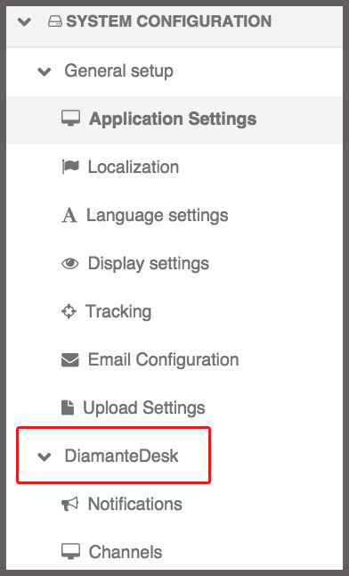
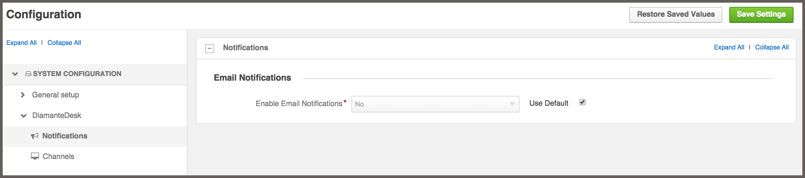
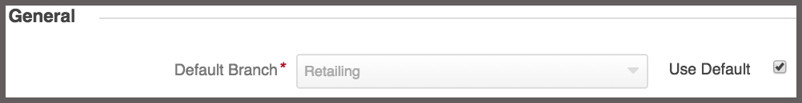

# Emails Processing

Diamante desk is a system that can be easily configured according to the customers' needs.To change the DiamanteDesk configuration, go to **System > Configuration**.

On the left side side of the screen on the **System configuration** pane select the Diamante Desk menu. Two submenus are available there:

* [Notifications](#notifications)
* [Channels](#channels)

## Notifications

**Email Notifications** is a DiamantDesk feature that sends automatic messages to the user who created a ticket when his ticket is being processed. 

To use the default settings, select the **Use Default** check box in the **Email Notifications** menu. 

To edit the configurations, clear the the **Use Default** check box and set the **Enable Email Notifications** field to **Yes** or **No** option.

To save the changes made, click **Save Settings** on the left top corner of the screen.

## Channels

All the fields in the **Channels** menu are required fields but each field has specific default settings. To use the default settings, select the **Use Default** check box in the corresponding field. To edit the configurations, clear the the **Use Default** check box in the corresponding field.

######General

In the **General** section select a default branch for email processing. All the newly created tickets will automatically get to the specified branch and later they can be reassigned to any other branch of your choice.
To set a default branch, make sure that the **Use Default** check box is clear, click the down arrow in the **Default branch** field and select the required branch from the drop-down list.

_Note:_ A branch configured as a default one cannot be deleted.

######Email

Configure the **Email** section to set up support email and make sure that all customer requests _sent to the service support email_ are automatically converted into tickets in the DimanateDesk system. The following fields may be set to default value or configured according to the Client needs:

* **Server Address.** Specify the domain name of the support email account (for example, mail.google.com, mail.outlook.com, etc.)
* **Port.** Provide the port number. _Hint:_ It is typically on port 143. But IMAP over SSL is usually on port 993.
* **SSL** Specify whether you want to use a secure connection (SSL) when retrieving your mail. Select **Yes** or **No** option.
* **Username.** Provide the username of a service support email (for example, support@diamantedesk.com)
* **Password.** Provide the password from a support email account.

######Web

Configure whether a user shall complete the registration process before creating a new ticket.

By default, registration is always required. To change this configuration, make sure that the **Use Default** check box is clear and set the **Registration required** field to **Yes** or **No** option.

To save the changes made, click **Save Settings** on the left top corner of the screen.