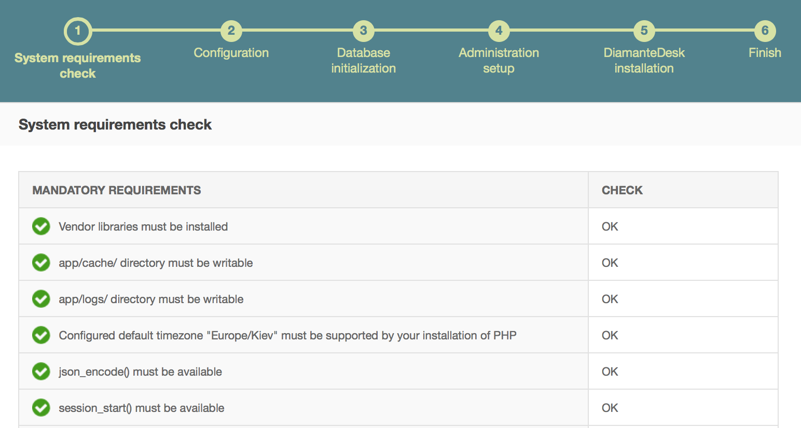
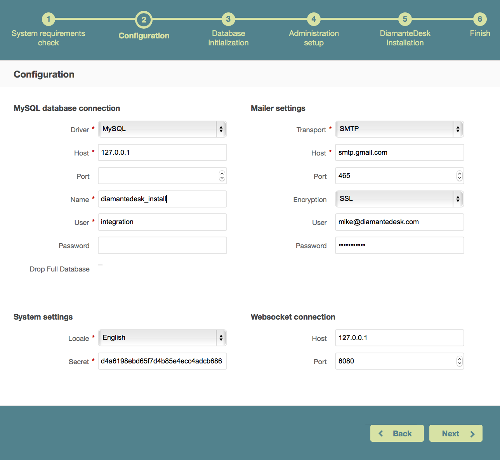
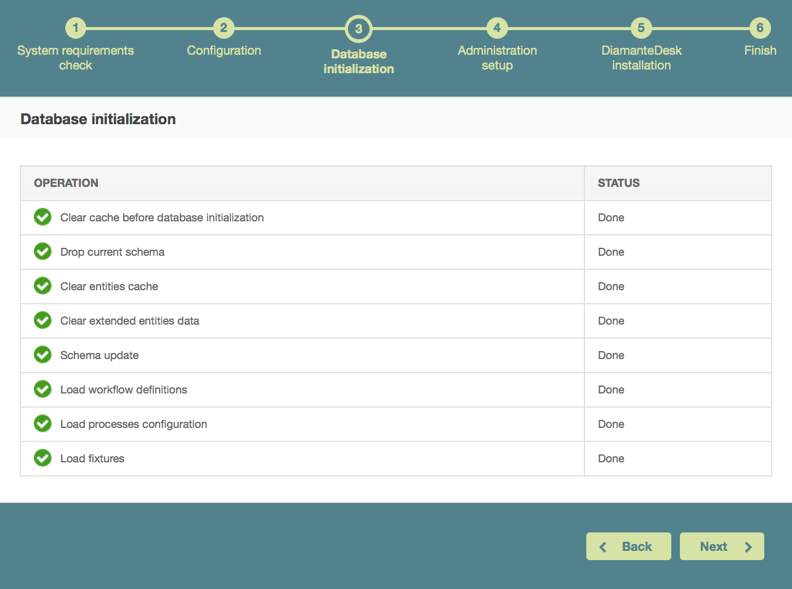
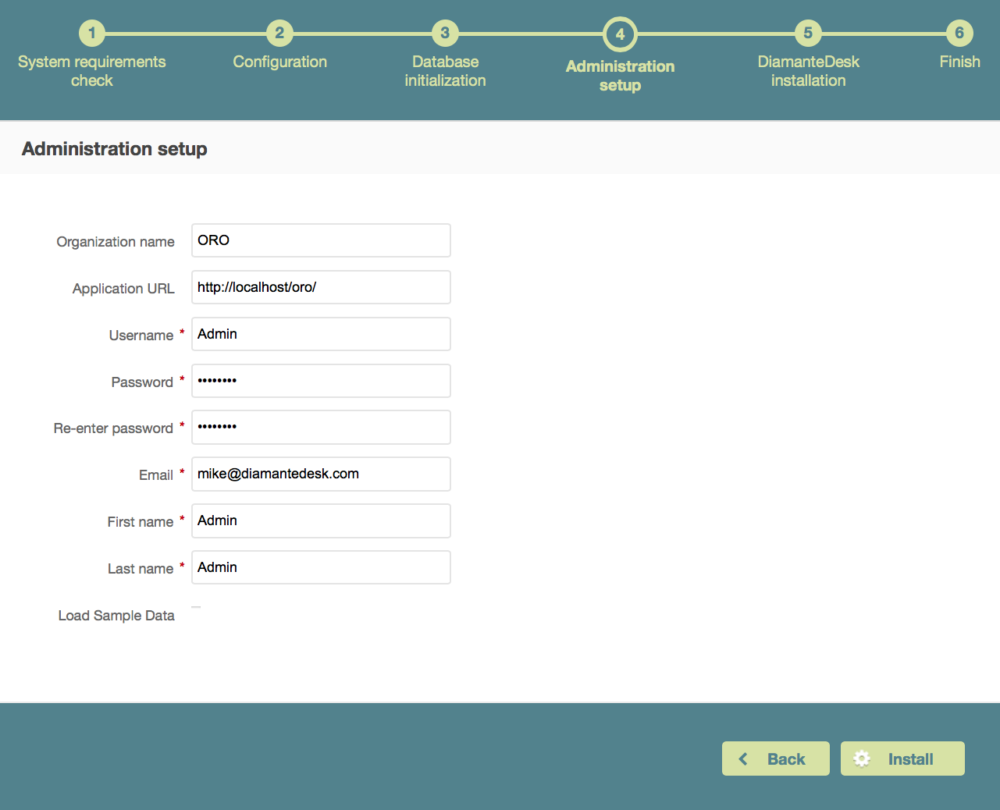

#Installation Guide

DiamanteDesk may serve as an independent end-user application or as an extension for OroCRM. In the nearest future it will also be available for other CRMs. 

This section provides detailed instructions on various options of DiamanteDesk application installation.

##Requirements

To run DiamanteDesk, your server shall adhere to the following [list of requirements](!!!!!!!!!!!!!!!). 

You can also check whether your system meets all the requirements from the command line. In order to do that, after you get the application code, execute the following command:

    php app/check.php

To install DiamanteDesk you also need to setup MySQL database server with an empty database that will be used later on.

DiamanteDesk uses **Composer** to manage package dependencies. You can download it from https://getcomposer.org/download/ or via the following command in the terminal:

    curl -s https://getcomposer.org/installer | php
    
##Web Server configuration

DiamanteDesk application was developed on a basis of the Symfony standard application so you can learn more about web server configuration recommendations [here](http://symfony.com/doc/2.3/cookbook/configuration/web_server_configuration.html).

## Installation of a Standalone Application

###Getting the Application

Download DiamanteDesk application from [GitHub](https://github.com/eltrino/diamantedesk-application/releases).

Clone the [GitHub repository](https://github.com/eltrino/diamantedesk-application#usage) to get a source code and checkout the required version of an application. Use the following command:

    git clone https://github.com/eltrino/diamantedesk-application

Checkout the latest version of the project:

     git clone -b 1.0 https://github.com/eltrino/diamantedesk-application
     
Download the application with the composer package manager using the following command:

    composer create-project diamante/desk-application
    
Install the dependencies with the composer:

    composer install

##Application Installation

###Installation Using a Console

To run the installation of DiamanteDesk in a console mode, use the following command:

     php diamante:install
     
Additional commands may be required. The system will guide you through the process with questions and command options.

If the system configuration does not meet the requirements, the _install_ command provides corresponding messages. In case there are any, fix them and run the command again.

###Installation Using Web Wizard

To start installation through a web wizard, follow the link below:

    http://integration.eltrino.com:8090/diamantedesk-install/web/install.php
    
When DiamanteDesk installation screen opens, click **Begin Installation**. 

Firstly, installation wizard automatically checks system requirements.

In case there are any issues, fix them and refresh the page. After all system configurations meet installation requirements, click **Next**.

The next step of installation process is configuring the application. Provide the data for **MySQL database connection**, **Mailer settings**, **System sttings** and **Websocket connection** if the fields are not filled out automatically.

Click **Next** and the installer will initialize your database. The list of tasks and the progress on their performance will be shown.

After you move on to the next step, you should provide such administrative information as company name, link to the application and administrative credentials. Make sure that **Load Sample Data** check box is empty.

After you click **Install**, the installer finishes setup. The list of tasks and the progress on their performance will be shown.

 
DiamanteDesk application is successfully installed after the status of all tasks turns to **Done**.

##Bundles Installation

Development in progress.

##Oro Marketplace

Development in progress.

##Docker Prebuilt Image 