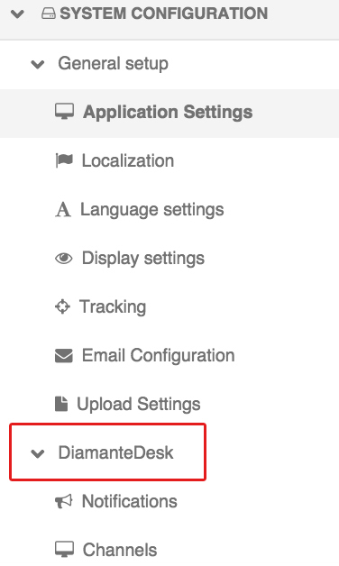

# Email Processing

DiamanteDesk supports 3 possible options of contacting a service Help Desk team in order to create a new ticket and make a request or report an issue. Any user can do it through a [Web Portal](web-portal.md), over the phone call or by sending an email to the support address.

All the emails that get to the support email address are automatically retrieved by the DiamanteDesk system in order to create a  separate ticket out of each received letter. To make sure that all customer requests sent to the service support email are automatically converted into tickets by the system, the email processing feature shall be configured at  _System > Configuration_.

## Configuaration

To configure email processing functionality, go to _System > Configuration_. On the **System Configuaration** pane select the **DiamanteDesk** menu and **Channels** tab.

The **Channels** screen opens.

_Note:_ All the fields in the **Channels** tab are required fields but each of them has specific default settings. To use the default settings, select the **Use Default** check box in the corresponding field. To edit the configurations, clear the the **Use Default** check box in the corresponding field and specify the  necessary value.

######General

In the **General** section select a default branch for email processing. All the newly created tickets will automatically get to the specified branch and later they can be reassigned to any other branch of your choice.
To set a default branch, make sure that the **Use Default** check box is clear, click the down arrow in the **Default branch** field and select the required branch from the drop-down list.

_Note:_ A branch configured as a default one cannot be deleted.

######Email

Configure the **Email** section to set up a support email. The following fields may be set to default value or configured according to the Client needs:

* **Server Address.** Specify the domain name of the support email account (for example, mail.google.com, mail.outlook.com, etc.)
* **Port.** Provide the port number. _Hint:_ It is typically on port 143. But IMAP over SSL is usually on port 993.
* **SSL** Specify whether you want to use a secure connection (SSL) when retrieving your mail. Select **Yes** or **No** option.
* **Username.** Provide the username of a service support email (for example, support@diamantedesk.com)
* **Password.** Provide the password from a support email account.

After all the necessary information has been provided, click **Save Settings** at the right top part of the screen.

##Run Email Processing

You can also run and configure email processing from the console. Two commands are available:

* using IMAP protocol for email retrieval from a remote email server.

        php app/console oro:cron:diamante:emailprocessing:general

This command may be configured through a crontab, allowing to send polls periodically on a given schedule it's perfect for retrieving emails from the remote server.

* or using the email piping method:

         php app/console diamante:emailprocessing:pipe <  /path/to/emails/stream

This command is only applicable when DiamanteDesk and email server are installed on the same server machine. It includes piping method which has a remarkable advantage over a IMAP, as,  when using piping, all the emails get to the system and are converted into tickets or comments **immediately**, unlike when using IMAP which sends polls to the remote server within scheduled time (at least 1 minute). This advantage allows to quicky react on customer requests or solve any issues on a real-time basis.