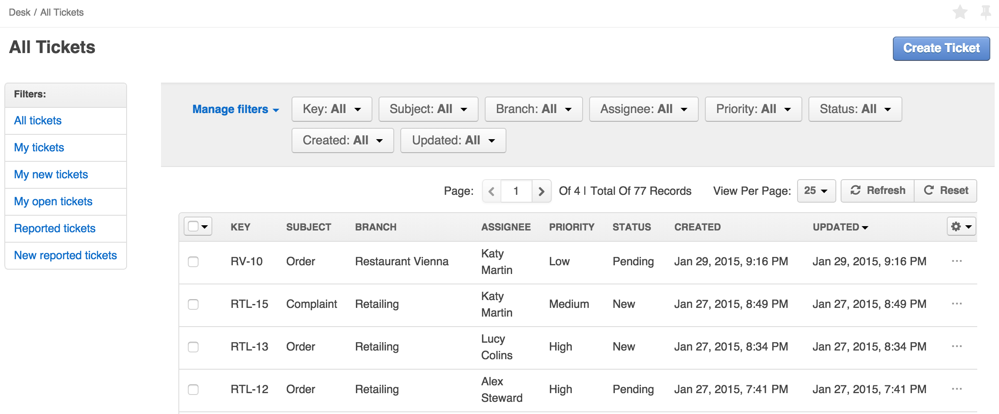

#Tickets

DiamanteDesk is a comprehensive help desk, built using the OpenSource software. This tool is a great way to improve customer experience by easily receiving, reassigning and taking care of any Client requests presented in **tickets**.

Tickets can be viewed and added at:

* the **Branches** tab (see [**Branches**](branches.md) section);
* the **All Tickets** tab.

##Ticket Filters

All the tickets on this screen can be filtered according to the number of various parameters:

1) A user can view tickets according to the categories they belong to.

  * **All tickets** category allows viewing all tickets created in the system.
  * **My tickets** category filters all the tickets created by the account owner.
  * **My new tickets** category filters all the tickets recently created by the account owner.
  * **My open tickets** category allows viewing all open tickets created by the account owner.
  * **Reported tickets**
  * **New reported tickets**

2) Tickets in each category can be also filtered by the following parameters:

>_Note:_ Each of the parameters is set to **All** values by default. To change this value, click the down arrow next to to the specific filter that shall be changed.

Filter   | Description
------------- | -------------
Key  | Enter the required branch key and click **Update**. Ticket Key consists of the branch key and ticket sequence number and has next format {_branchKey_}-{_ticketSequenceNumber_}. 
Subject | Provide the summary of a ticket in this field.
Branch | Select the required branch from the drop-down list and click **Update**.
Assignee | To filter the tickets assigned to a specific person, enter the name of that person into the **Assignee** field. _Note:_ You can't change this value when looking through the tickets in **My tickets** and **My new tickets** categories, the assignee in these categories is always an owner of the account.
Priority | Set the filter to **Low**, **Medium** or **High** priority.
Status | Select one or several statuses for ticket filtering. The available statuses are: **New**, **Open**, **Pending**, **In progress**, **Closed** and **On Hold**.
Created | Select the date range when the tickets could could be updated either from a drop-down calendar or by selecting one of the available variables (Now, today, Start of the week, Start of the month, Start of the quarter, Start of the year).
Updated | Select the date range when the tickets could could be updated either from a drop-down calendar or by selecting one of the available variables (Now, today, Start of the week, Start of the month, Start of the quarter, Start of the year).

## Create a New Ticket

To create a new ticket, complete the following steps:

1. Click **Create Ticket** at the top right corner of the screen. **Create Ticket** screen opens.

2. Select the branch from the drop-down list.
3. Specify the short summary of a ticket in the **Subject** field.
4. Select the status of a ticket.
5. Select the priority of a ticket.
6. Select the **Source** of the ticket. Every service user has 4 available options to contact the Help Desk team: by creating a request through a **Web** form or through the embedded form on a website (optional), as an **Email** notification, via a **Phone** call.
7. Select the **Reporter** from the drop-down list. Reporter is an administrator who can create a ticket for any customer.
8. To select the **Assignee**, click **Unassigned**. A Search Panel opens. Start entering the name of the person to be assigned and the system will provide hints with the matching results or click a list image to open a list of all available assignees. 
9. In case there is a file that shall be attached to the ticket (image or document), click **Choose file** in the **File** filed and select the required file from your local machine.
11. Provide the description of a ticket in the **Description** field.
12. Click **Save** or **Save and Close** at the right top corner of the screen for a corresponding action.

## Notifications

**Email Notifications** is a DiamantDesk feature that sends automatic emails to the ticket creator and assignee when the ticket is created or its [status](#status) changes. This way a customer is notified whether his request is being processed.

When the ticket is created, a reporter and assignee get the following emails, informing them about ticket branch, subject, priority, status and source:

When the status of a ticket changes, the reporter and assignee get the following email, informing them about changes performed and the person responsible for them:

### Configuring Notifications

This functionality can be configured according to the customers' needs at _System > Configuration_. On the left side side of the screen on the **System configuration** pane select **Notifications** tab in the **DiamanteDesk** menu.

**Notifications** tab opens.

To use the default settings, select the **Use Default** check box in the **Email Notifications** field. 

To edit the configurations, clear the the **Use Default** check box and set the **Enable Email Notifications** field to **Yes** or **No** option.

To save the changes made, click **Save Settings** on the left top corner of the screen.

### Server Setup

The mailer settings for emails and notifications are usually configured during DiamanteDesk installation. To learn more about the process of installation, navigate to the Installation Guide section of the documentation.

To make sure that server parameters are configured correctly or you need to change them, define required configuration details in the **app/config/parameters.yml** file. If you need more information on how to perform configurations in the **app/config/parameters.yml** file, follow this [link](https://symfony.com/doc/current/best_practices/configuration.html).

