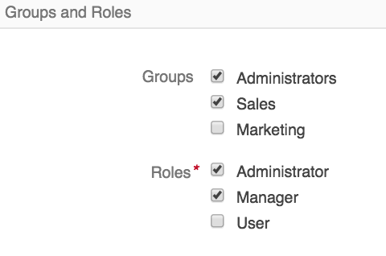

#User Management

**User Management** serves to create new users in DiamanteDesk or to review/edit information about the existing ones. Each user has a certain role, access settings and belongs to one of the existing groups, defining his default permissions in the system.

To review the list of all users in the system head over to _System > User Management > Users_:

## Create User

To create a new user profile in the DiamanteDesk system, head over to _System > User Management > Users_ and click the **Create User** button at the right top corner of the screen or go directly to _System > User Management > Create User_.

After you get to the **Create User** screen, fill out all the required fields in five sections, that is **General**, **Additional**, **Groups and Roles**, **Access Settings**, **Email synchronization settings**.

* The **Owner** field is automatically filled with **Main** value by default.
* Select the **Status** of an account - it can be either **Active** or **Inactive**.
* Create a **Username** and **Password** that will be used by a newly created user to log in. **Re-Enter** the password in the following filed to make sure you typed it in correctly.
* Enter a user **Name Prefix**, if required (Mr, Ms, etc.)
* **First Name, Middle Name, Last Name**
* Enter a user **Name Suffix**, if any (for example, Jr., Sr., PMP, etc.)
* Select the **Birthday** from the drop-down calendar in the corresponding field.
* Click the **Avatar** to select a profile picture from your local machine.
* Enter the user's **Primary Email** in the corresponding field. This email is going to be used for email notifications and password recovery. Click **Add Another Email** in the **Emails** field to add additional email in case the primary one is not available for any reason.
* **Email Signature**
* **Phone**
* **Tags.** Tagging functionality is identical throughout the system. To learn more about tagging, follow this [link](tagging.md).

Provide the **Title** (position) of a newly created user in the section for **Additional** information.

Select the **Groups** and **Roles** the newly created user will belong to. More than one group or role may be selected for one user.

Set **Access Settings** !!!!!!!!!!!!

### Edit User Account

To edit user account in the DiamnateDesk system:

1. Go to the list of all users in the system at _System > User Management > Users_.
2. Select the user account that shall be changed.
3. Perform required the changes.
4. Click **Save and Close** or **Save** at the right top corner of the screen.

## User Roles

User role determines the permissions of a person authorized, meaning what actions a user is allowed to perform. To look through the list of available User Groups head over to _System > User Management > Roles_.

## User Groups

A user group is a collection of user accounts having the same core responsibilities (for example, Administrators, Marketing, Sales). To look through the list of available User Groups head over to _System > User Management > Groups_.

### Create a New User Group

1. Go to _System > User Management > Groups_.
2. Click **Create Group** at the right top corner of the screen. The **Create Group** screen opens.

3. The **Owner** field is automatically filled with **Main** value by default.
4. Provide the general name of the group in the **Name** field.
5. Choose the members belonging to this group by selecting the check boxes in the corresponding lines.
6. Click **Save** or **Save and Close** to proceed.

>_Note:_ Any user can belong to more than one group.