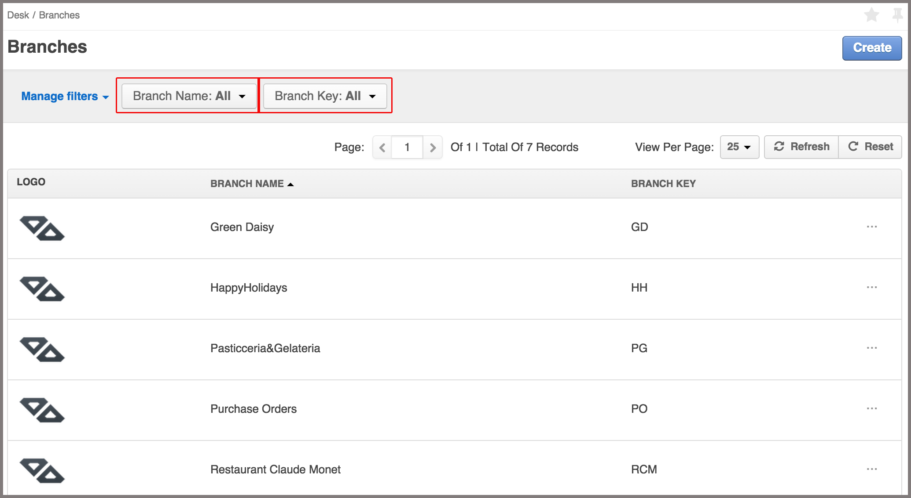
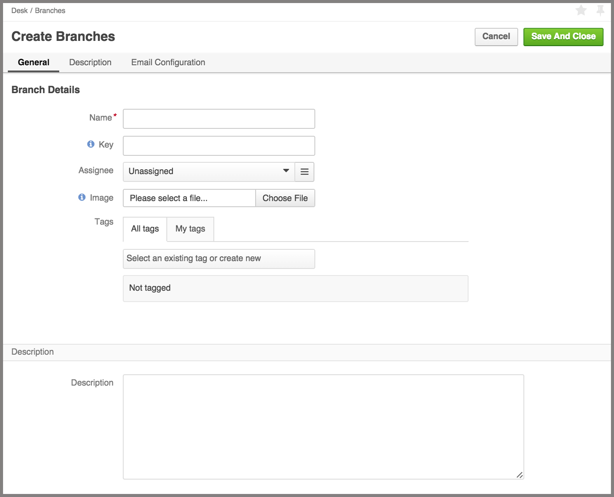
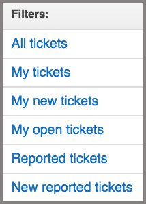
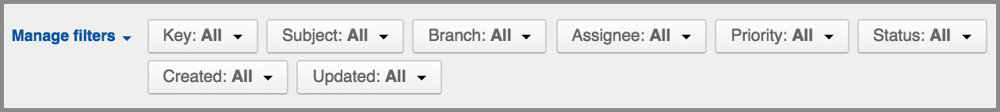
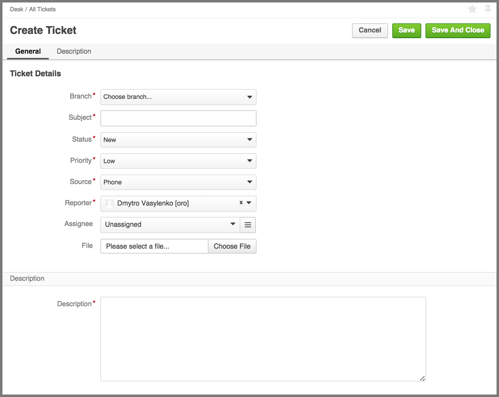

#DiamanteDesk Backend Userguide

DiamanteDesk is a comprehensive help desk, built using the OpenSource Software. This tool is a great way to improve customer experience by easily receiving, reassigning and taking care of any client requests presented in tickets.

Tickets are sorted according to the Branches where they are created. To see the list of all available branches, go to **Desk > Branches**. 

The branches can be filtered according to the **Branch Name** or **Branch Key**. 

Branch key is automatically generated from the branch name when a new branch is created and it should be unique across the system. Branch key must contain only letters. Minimum length is 2 letters. If Branch name consists of more than one word, the system takes the first character of every word and converts them to upper case (for example, Green Daisy - GD, Diamante Desk - DD, etc.). If branch name consists of a single word, branch key is generated from the first 2-4 characters in the upper case (for example, Eltrino - ELTR, bbq - BBQ, etc.).

**Branch name** and **Branch Key** filters are set to **All** values by default. To filter the branches according to a certain branch name or key, click the down arrow in the corresponding filed and enter the required name or key. To refresh the results, click **Refresh**. To clear all filters, click **Reset**.

To create a new branch:

1. Go to Desk > Branches.
2. Click **Create** at the right top corner of the screen. **Create Branches** screen opens.

3. _Required field._ Enter the name of a new branch into the **Name** field.
4. Leave a **Key** field empty as it is automatically filled by the system. Branch Key is generated from the branch name and it should be unique across the system.
5. To select the **Assignee**, click **Unassigned**. A Search Panel opens. Nest, two options are available:
   * Start entering the name of the person to be assigned and the system will provide hints with matching results.
   * Click a list image to open a list of all available assignees. 
_Note_ If you have selected a wrong assignee, click the X button next to the name of an assignee.
6. Add an image that will serve as a branch logo to the **Image** field. To do that, click **Choose file** and select a corresponding image from your local machine.
7. Provide the description of the branch in the **Description** filed.
8. EMAIL CONFIGURATION !!!!???
9. Click **Save And Close** at the right top corner of the screen.

***
Tickets can be also viewed without branch sorting at **Desk > All Tickets**.

All the tickets on this screen can be filtered according to the number of various parameters:

1) On the left side of the screen you can view all tickets by the following categories:

  * **All tickets** category allows viewing all tickets created in the system.
  * **My tickets** displays all the tickets created by the account owner.
  * **My new tickets** displays all the tickets recently created by the account owner.
  * **My open tickets** displays all open tickets created by the account owner.
  * **Reported tickets** !!!!!??????
  * **New reported tickets** !!!!!??????

2) Tickets in each category can be also filtered by the following parameters:

_Note:_ Each of the parameters is set to **All** values by default. To change this value, click the down arrow next to to the filter that shall be changed.

* **Key.** Enter the required branch key and click **Update**. Ticket Key consists of the branch key and ticket sequence number and has next format {_branchKey_}-{_ticketSequenceNumber_}. 
* **Subject.** Provide the summary of a ticket in this field.
* **Branch.** Select the required branch from the drop-down list and click **Update**.
* **Assignee**. To filter the tickets assigned to a specific person, enter the name of that person into the **Assignee** field.
_Note:_ You can't change this value when looking through the tickets in **My tickets** and **My new tickets** categories, the assignee in these categories is always an owner of the account.
* **Priority.** Set the filter to **Low**, **Medium** or **High** priority.
* **Status.** Select one or several statuses for ticket filtering. The available statuses are:
  * New
  * Open
  * Pending
  * In progress
  * Closed
  * On Hold
* **Created** Select the date range when the tickets could have been created either from a drop-down calendar or by selecting one of the available variables (Now, today, Start of the week, Start of the month, Start of the quarter, Start of the year).
* **Updated.** Select the date range when the tickets could have been updated either from a drop-down calendar or by selecting one of the available variables (Now, today, Start of the week, Start of the month, Start of the quarter, Start of the year).

To create a new ticket, complete the following steps:

1. Click **Create Ticket** at the top right corner of the screen. **Create Ticket** screen opens.

2. Select the branch form the drop-down list.
3. Specify the subject of a ticket - !!!????
4. Select the status of a ticket.
5. Select the priority of a ticket.
6. Select the **Source** of the ticket. Every service user has 3 available options to contact the Help Desk team:

   * by creating a request through a **Web** form;
   * as an **Email** notification;
   * via a **Phone** call.
7. Select the **Reporter** from the drop-down list. !!!????
8. To select the **Assignee**, click **Unassigned**. A Search Panel opens. Start entering the name of the person to be assigned and the system will provide hints with the matching results.
OR
Click a list image to open a list of all available assignees. 
9. In case there is a file that shall be attached to the ticket (image or document), click **Choose file** in the **File** filed and select the required file from your local machine.
10. Provide the description of a ticket in the **Description** field.
11. Click **Save** or **Save and Close** at the right top corner of the screen for a corresponding action.