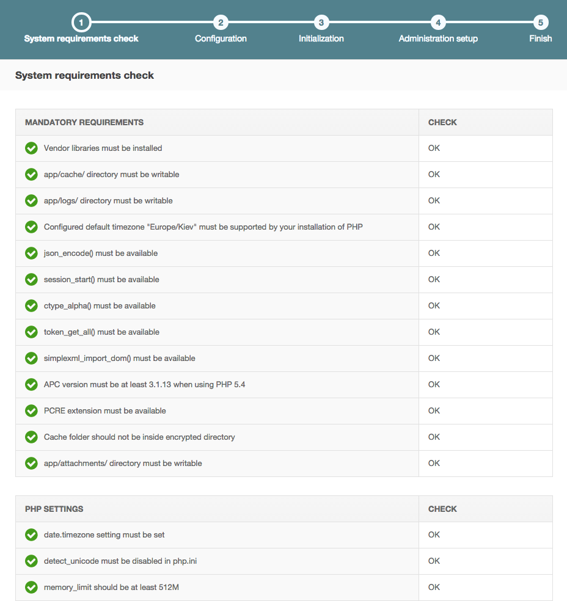
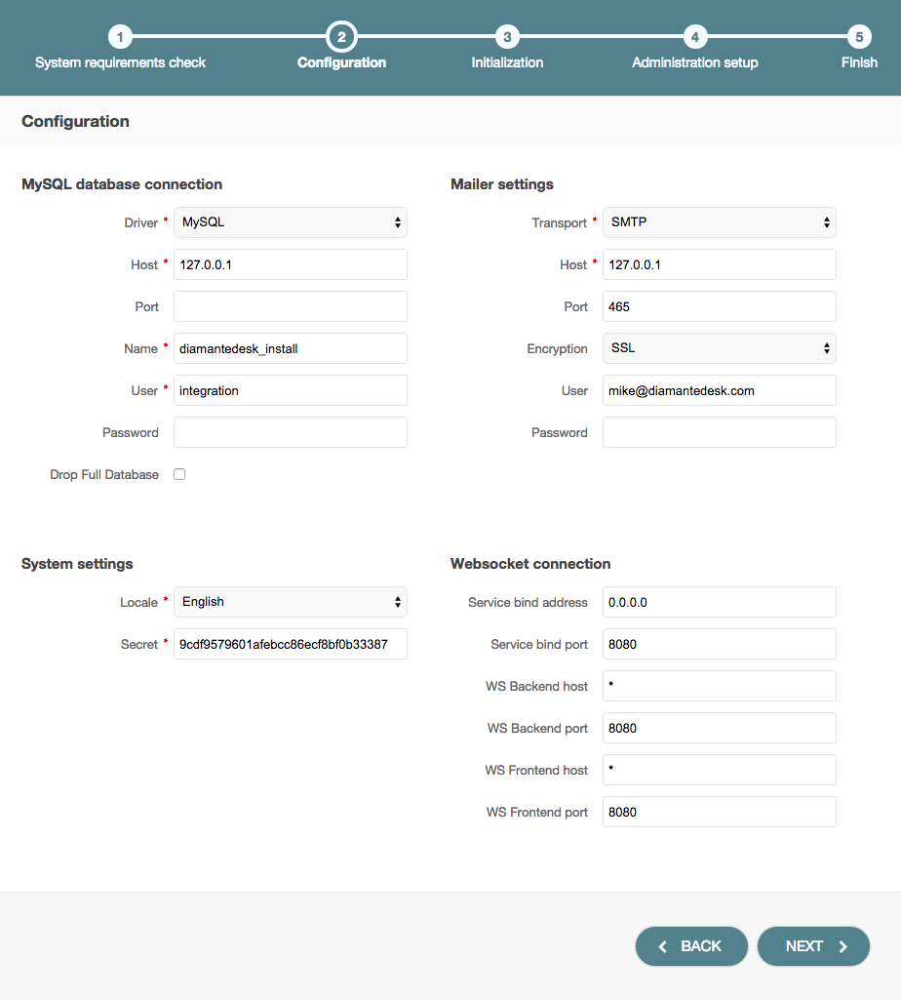
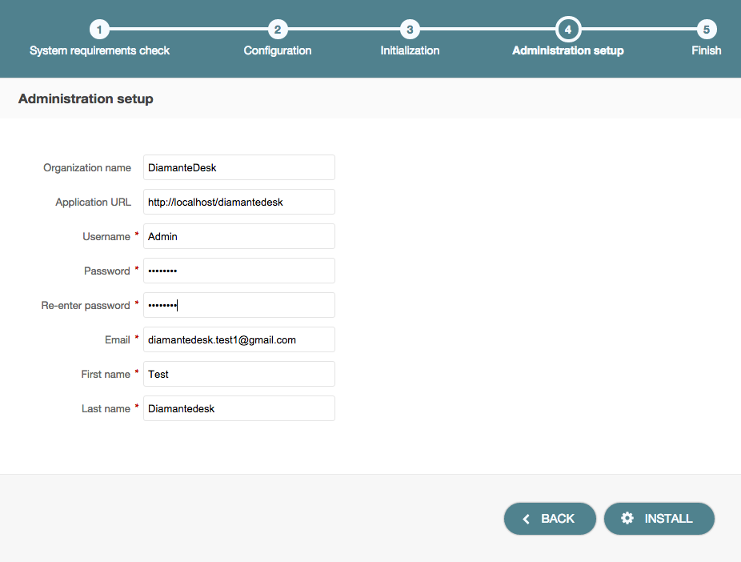

DiamanteDesk may serve as an independent end-user application or as an extension for OroCRM. In the nearest future it will also be available for other CRMs. 

This section provides detailed instructions on various options of DiamanteDesk application installation.

##Requirements

DiamanteDesk application was built using **Symfony** 2.3 framework and **Oro** Platform; therefore, all the prerequisites listed as [Symfony](http://symfony.com/doc/2.3/reference/requirements.html) and [Oro](http://www.orocrm.com/documentation/index/current/system-requirements) system requirements also refer to DiamanteDesk.

In addition, here is a list of requirements related specifically to the DiamanteDesk application:

* app/attachments folder needs to be writable;
* NPM package manager needs to be installed;
* Grunt needs to be installed (globally);
* Bower needs to be installed (globally).

To install DiamanteDesk you also need to setup MySQL database server with an empty database that will be used later on.
_____

You can also check whether your system meets all the requirements from the command line. In order to do that, you should start with getting the [application code](#get-code) from Github and installing required [libraries](#libraries). Then you can run the following command:


php app/check.php

    
###Web Server configuration

DiamanteDesk application was developed on a basis of the Symfony standard application so you can learn more about web server configuration recommendations [here](http://symfony.com/doc/2.3/cookbook/configuration/web_server_configuration.html).

> _Note:_ DiamanteDesk application makes heavy use of HTTP methods in RESTful calls. The server can be configured to block some of them (for example, PUT, DELETE, etc.). However, this limitation should be removed, otherwise, a certain part of application will not function properly.

### Composer

DiamanteDesk uses **Composer** to manage package dependencies. Use this [link](https://getcomposer.org/download/) to download it. All the following examples are be based on the assumption that the composer have been installed globally.

## Installation of a Standalone Application

###  Getting the Application

Download DiamanteDesk application from [GitHub](https://github.com/eltrino/diamantedesk-application/releases).

Clone the [GitHub repository](https://github.com/eltrino/diamantedesk-application#usage) to get a source code and checkout the latest developed version of an application. Use the following command:


git clone https://github.com/eltrino/diamantedesk-application


Checkout the latest stable version of the project:


git clone -b 1.0 https://github.com/eltrino/diamantedesk-application

     
Also, download the application with the composer package manager using the following command:


create-project diamante/desk-application:1.0.*

    
###  Installing required libraries

Install the dependencies with the composer:


composer install


### Application Installation

######Installation Using a Console

To run the installation of DiamanteDesk in a console mode, use the following command:


php diamante:install

     
Additional commands may be required. The system will guide you through the process with questions and command options.

If the system configuration does not meet the requirements, the _install_ command provides corresponding messages. In case there are any issues, fix them and run the command again.

######Installation Using Web Wizard

To install the application through a web wizard, follow the link below:


http://localhost/install.php

    
When DiamanteDesk installation screen opens, click **Begin Installation**. 

Firstly, installation wizard automatically checks system requirements.

In case there are any issues, fix them and refresh the page. After all system configurations meet installation requirements, click **Next**.

The next step of installation process is configuring the application. Provide the data for **MySQL database connection**, **Mailer settings**, **System sttings** and **Websocket connection** if the fields are not filled out automatically.
> _Note:_ If the application is installed for the first time, leave the **Drop Full Database** check box clear, if you reinstall the application, select this check box.

Click **Next** and the installer will initialize your database. The list of tasks and the progress on their performance will be shown.

After you move on to the next step, you should provide such administrative information as company name, link to the application and administrative credentials.

Click **Install** to finish the setup process. 
 
After the DiamanteDesk application is successfully installed the following message is displayed:

##Bundles Installation

Development in progress.

##Oro Marketplace

Development in progress.

##Docker Prebuilt Image 

To learn more on how to use Docker image, please follow this [link](https://github.com/eltrino/diamantedesk-docker).