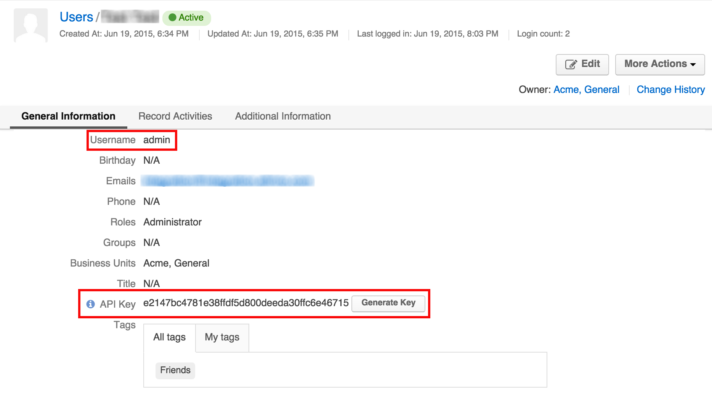

Our team uses API method to integrate DiamanteDesk plugins or modules with different content management systems. API stands for Application programming interface, so it is a software-to-software interface that enables different programs to connect and share information between each other.

DiamanteDesk API integration serves to create individual customer support systems to all sorts of web portals, on-line stores and blogs. Currently, DiamanteDesk is integrated with [Magento](magento.html), [WordPress](wordpress.html) and [PrestaShop](prestashop.html) content management systems.

To connect a content management system and the Client's CRM, API credentials shall be provided.

**Getting API Credentials**

1. Log in to **DiamanteDesk Admin Panel**.
2. On the navigation pane select **System > User Management > Users**.

3. **Users** screen opens. Click the required user name from the list to open the user profile.

4. Remember the **Username** and click **Generate Key** in the **API Key** field. Copy the generated API key.

_**Note:** **API Key** can be generated for any user on the profile screen by the user with **Edit** permissions._