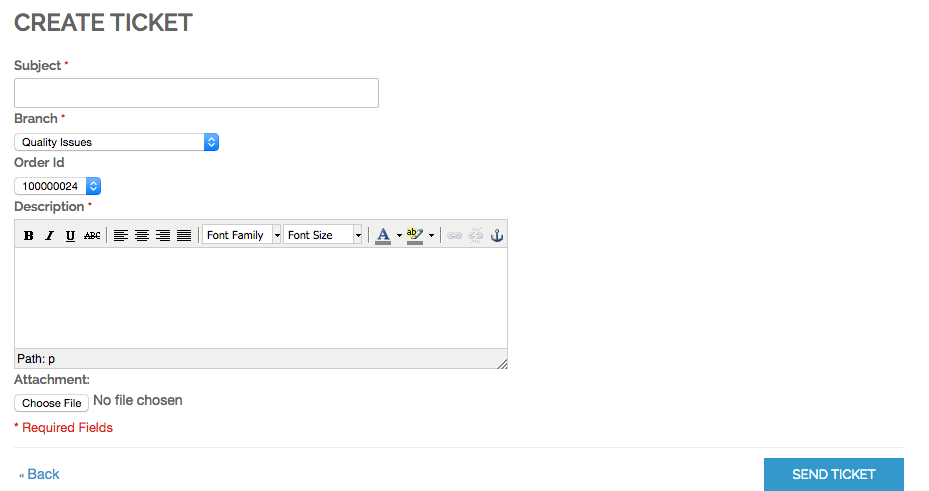
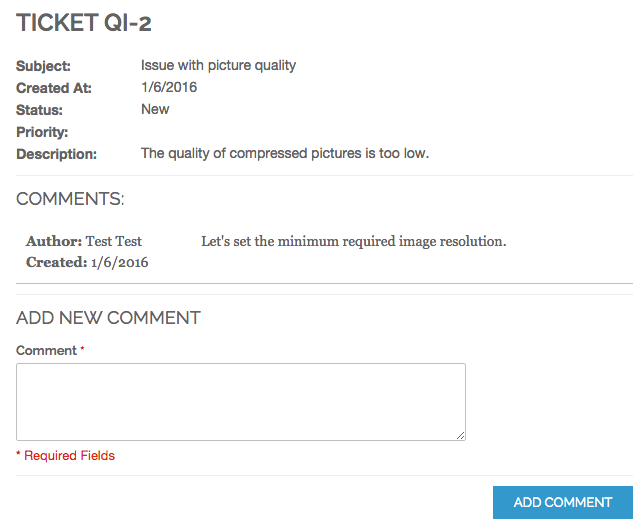
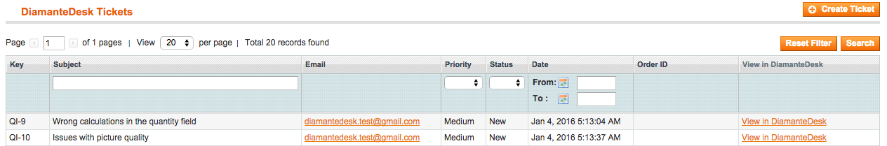
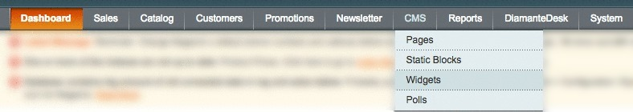
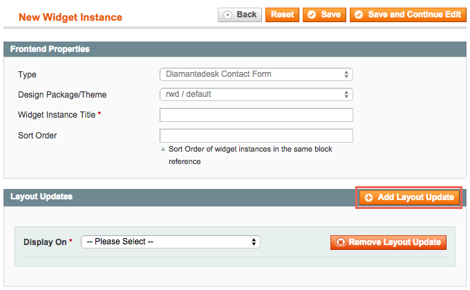

Magento is a popular content management system that allows creating powerful e-commerce solutions. As a matter of fact, every e-commerce website should have a reliable support system that helps to quickly solve any issue, build strong customer relationships and improve overall user experience. Integrating DiamanteDesk with a website built with Magento may be the easiest solution for that.

DiamanteDesk Magento module allows both administrator and any customer to create, edit and view tickets directly from a Magento powered e-commerce website. 

##Installing DiamenteDesk Extension

After installing DiamanteDesk integration module, it shall be configured at the Magento admin panel.

1. Log in the **Magento Admin Panel**.
2. In the navigation panel select _System > Magento Connect > Magento Connect Manager_.

3. Re-enter your Magento Administration credentials to verify your permissions.

Select automatic or manual installation and complete the following steps:

**Automatic Installation**

1. On the **Magento Connect Manager** screen follow the [Magento Connect](https://www.magentocommerce.com/magento-connect/) link in the **Install New Extensions** section.

The extension marketplace opens.
2. Enter **DiamanteDesk** in the **Search for Extensions** field and press Enter.

3. Select the corresponding extension module from the search results.
4. Click **Get Extension**.

**Manual Installation**

**Option 1 - Installation via FTP:**

1. Upload the addthis folder to the root Magento directory.
1. Head over to the Magento admin area and connect DiamanteDesk and Magento (see the **Connecting DiamanteDesk to Magento** section).

**Option 2 - Installation via archive:**

1. Download DiamanteDesk Module archive from Github.
2. On the **Magento Connect Manager** screen, **Extensions** tab head over to the **Direct package file upload** section.

3. Select the downloaded DiamanteDesk .zip file from the local machine.
4. Click **Upload**.
5. Provide your Magento Administration Credentials in the **Manage Existing Extensions** section below.
6. After all the packages have been uploaded, move to **Settings** tab, and click **Save Settings**.

**Option 3 - Installation via Composer:**

1. Add [Firegento](http://packages.firegento.com/) repository to your ` composer.json `.
2. Add as dependency to your project using composer:

        composer require eltrino/diamantedesk
        
           
_**Note:**_ 

_* Make sure that you clear the Magento caches to complete the installation of an extension. To learn more about cache management, follow this [link](http://www.magentocommerce.com/knowledge-base/entry/cache-storage-management/%09200)._

_* If the module has been successfully installed, a **DiamanteDesk** tab will appear next to the **System** tab in the Magento navigation pane (see the picture below)._

## Connecting DiamanteDesk to Magento
After DiamantDesk module has been installed, we need to connect the actual help desk to Magento. 

In order to do that, complete the following steps:

1. Acquire [API credentials](api-credentials.md) from your CRM.
5. Get back to Magento Admin Panel.
6. Go to _System > Configuration > DiamanteDesk_. **DiamanteDesk** configuration screen opens.
7. Enter the **User Name** and **Api Key** from your CRM.

8. Provide the link to the server in the **Server Address** field.
9. Click **Check Connection** to make sure that the connection with a server has been successfully made.
10. If the **Api Credentials** are correct, a new **Branch Configuration** field will be added to the DiamanteDesk configuration. Select a default branch from the **Branch** drop-down list. To learn more about branches in DiamanteDesk, see the **Branches** section in User Guide.

10. Point out whether the customer support footer link to shall be displayed. Select **Yes** or **No** option in the **Display footer link** field.
11. If the footer link is to be displayed, spcify the corresponding link to the customer support page in the field below.
11. Click **Save Config** on the right top corner of the screen.

## DiamateDesk in Action

After DiamanteDesk is installed, every customer registered in your Magento powered store can create a ticket and inform your support team on any issues directly from his account in **My Tickets** menu. 

###Create a New Ticket in Magento Store

To create a new ticket in Magento store, follow these steps:

1. Log into or register in the Magento powered store.
2. Navigate to **My Tickets** menu on the left side of the screen.
3. Click **Create Ticket** at the right side of the screen. **Create Ticket** screen opens.

4. Provide general idea of an issue/request in the **Subject** field.
5. Select a branch related to the subject of your issue/request.
5. **Order ID** is an optional field and it is invisible if the user hasn't made any orders yet. Order ID may be selected from the drop-down list in case a user attempts to create a ticket related to a specific order.
5. Provide the ticket subject and precise description of the ticket in the corresponding fields. Providing as many details as possible guarantees that the support team will handle your ticket properly.
6. In case of some issues related to user interface, providing screenshots might be helpful as well. In order to add a screenshot or other files that may help to resolve issues or add some improvements, click **Choose File** below the **Description** field. Select the corresponding file(s) from your local machine and click **Open**. Once the file is attached, its name is shown near the **Choose File** button. 
7. Click **Send Ticket** to submit the newly created ticket to the support team. To cancel the process of ticket creation click **Back**.

A customer can see all his tickets in **My Tickets** menu and check their status and priority to follow up on the ticket resolution progress.

###Adding Comments to a Ticket

Once the comment is created, a customer and administrators can add comments to it. 

To add a comment to the ticket, a registere customer should navigate to **My Tickets** menu, select the required ticket and click **View** to open it, type in a comment into the **Comment** field and click **Add Comment**.

Administrators respond to customer comments or tickets at the DiamanteDesk admin panel as described in [this article](http://docs.diamantedesk.com/en/latest/user-guide/tickets.html).

### DiamanteDesk in Magento Admin Panel

**All DiamanteDesk Tickets**

All the administrators who have access to the Magento admin panel can view all tickets created for this store. To do that, navigate to DiamanteDesk tab in the general  Magento navigation panel. 

**DiamanteDesk Tickets** screen opens.

Administrators can create new tickets by clicking **Create Ticket** above the table listing all the previously created tickets. The procedure of ticket creation is identical to ticket creation procedure in DiamanteDesk admin panel, described in [this article](http://docs.diamantedesk.com/en/latest/user-guide/tickets.html).

Table containing all tickets previously created by store customers and administrators consists of the following fields:

Field  | Description
------------- | -------------
Key | Ticket Key consists of the selected branch key and ticket sequence number and has next format {_branchKey_}-{_ticketSequenceNumber_}. 
Subject | Contains a short summary of a ticket provided by the ticket author.
Email | Displays email of a user who created this ticket.
Prioroty | Displays current priority of a ticket. All the tickets created from the Magento powered store have a **Medium** priority by default.
Status | Displays current status of a ticket.
Date | Displays the date when the ticket was created.
Order ID | This field is populated with the corresponding order ID number in case a user created a ticket related to some specific order. 
View in DiamanteDesk | Additional ticket details, description or comments can be seen only at the DiamanteDesk admin panel. This link redirects a user to the specific ticket in the DiamanteDesk admin panel. _**Note:** additional credentials are required to log in DiamanteDesk admin panel._

**Customer Tickets**

To view all tickets created by a specific customer:

1. Navigate to _Customers > Manage Customers_.
2. Select a required customer from the list. **Customer Information** screen opens.
3. Select **Tickets** menu from the navigation pane at the left side of the screen. All customer tickets are shown there.

**Order Tickets**

To view all tickets related to a specific order:

1. Navigate to _Sales > Orders_.
2. Select a required order from the list. **Customer Information** screen opens.
3. Select **Tickets** menu from the navigation pane at the left side of the screen. All order tickets are shown there.

### DiamanteDesk Contact Form

DiamanteDesk contact form can be easily added to any section of an online store page as a widget. In order to do that, navigate to _CMS > Widgets_.

**Manage Widget Instances** screen opens. To add a DiamanteDesk contact form widget, click **Add New Widget Instance**. The **New Widget Instance** screen opens. 

On the settings menu and **Type** field select **DiamanteDesk Contact Form** from the drop-down list. Specify corresponding value in the **Design Package/Theme** field. Click **Continue**.

_**Note:** Once you click **Continue**, **Type** and **Design Package/Theme** fields become uneditable._

Now, specify **Widget Instance Title** in the corresponding field.

Click **Add Layout Update** to display the contact form on the front of the online web store. Once finished, click **Save** or **Save and Continue Edit**.

Check the store website to make sure the contact for is in the right position.