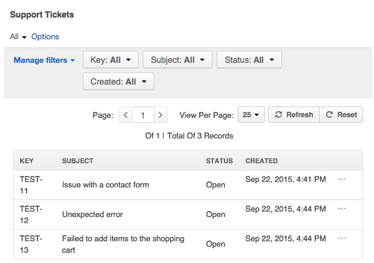
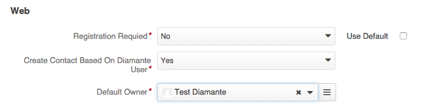

DiamanteDesk offers seamless integration with the open-source OroCRM, providing efficient and simple ticket management tool.  Therefore, DiamanteDesk can be installed as a help desk extension to OroCRM. The following guide describes various options of DiamanteDesk installation as an extension to OroCRM and all the functionality related to this integration.

When installed on the basis of the OroCRM, DiamanteDesk functionality is available at the **Desk** top menu.

This menu provides fast and easy access to the general functionality and data of the DiamanteDesk application, specifically to:

* [Branches](../user-guide/branches.html)
* [Tickets](../user-guide/tickets.html)
* [Reports](../user-guide/reports.html)

##Installation

Prior to installing DiamanteDesk as an extension to OroCRM make sure that you have properly installed OroCRM.

###Installation via Oro Marketplace

Navigate to `System > Package Manager` to install it from OroCRM Marketplace.

###Installation via Composer

Execute this command to start installing DiamanteDesk:


php composer.phar require diamante/orocrm-integration-bundle


To proceed with installation, you should install the required DiamanteDesk bundles using the following commands:


php app/console diamante:desk:install



php app/console diamante:user:schema



php app/console diamante:embeddedform:schema



php app/console assets:install



php app/console assetic:dump


Further installation steps:

1. Set up mailer parameters in `parameters.yml` and at _System > Configuration > DiamanteDesk > Channels_.
2. Enable notifications at _System > Configuration > DiamanteDesk > Notifications_. 

## DiamaneteDesk Contacts in OroCRM

In the Oro platform all the contacts related to any business activities are saved at _Customers > Contacts_. Please refer to the Oro [documentation](http://www.orocrm.com/documentation/index/current/user-guide/contacts) to learn more about contacts in OroCRM. Due to the DiamanteDesk integration with Oro, when a customer registers on the support [portal](http://orocrmqa.eltrino.com:8090/diamante_1.1/web/app_dev.php/portal/#login) to make a request or report an issue regarding the supported entity (online store, blog, etc.), the provided credentials are  added both to the DaiamnteDesk and to the OroCRM contacts. To learn how to configure this option, refer to the [**Configuration**](#configuration) section of this article.

When a user registeres on the portal, the system automatically scans the contact database by the existing emails. If none of the emails match the provided credentials, a new contact is created based on the data provided by the user. If an account with the same email has  been previously registered in the system, the following warning message is displayed:

The identical procedure occurs when OroCRM administartor creates a new DiamanteDesk user from the admin panel at _Customers > Contacts > Create Customer_.

This feature can be disabled at _System > Configuration > DiamanteDesk_.

## Tickets in OroCRM

When DiamanteDesk is installed on the basis of the OroCRM, administrators can view the tickets submitted to the system in the following sections:

* _Desk > Branches_. Tickets in the DiamanteDesk are grouped into the **Branches**. Creating separate branches enables our Clients to group tickets according to the requests of specific users, locations, issues or according to the [Channel](../user-guide/channels/index.html) the ticket came from. Open the required branch to see all the tickets that belong to it.

* _Desk > All Tickets_. Tickets can be accessed directly at the **Tickets** section. They are not grouped according to any category on this screen an can be filtered according to the ticket **Key**, **Subject**, **Branch**, **Assignee**, **Priority**, **Status**, or time period when it was **Created** or **Updated**.

* _Customers > Accounts_. Account records referred to as **Accounts** in OroCRM are created to collect and analyze the information on customer activity of a person or group of people belonging to a certain company or organization. Administrators can view all the tickets created or updated by the users belonging to this account at the read-only **Support Tickets** grid in the **Additional Information** section. It displays general ticket information, such as ticket **Key**, **Subject**, **Status**, **Reporter** and date and time when it was updated.

* _Customers > Contacts_. The **Customers** screen contains information about all the customers who created tickets at the [DiamanteDesk portal](../user-guide/channels/portal.html). Administrators can view all the tickets created or updated by the certain customer at the read-only **Support Tickets** grid in the **Additional Information** section. It displays general ticket information, such as ticket **Key**, **Subject**, **Status** and date and time when it was created.

 
## Configuration

As previously mentioned, when DiamanteDesk is installed on the basis of OroCRM, all the contacts created through the DiamanteDesk support portal are automatically added to the OroCRM contact database. To learn more about contacts in DiamanteDesk, refer to the corresponding section of the [User Guide](../user-guide/customers.html). 

To configure this option, navigate to **System > Configuration**. The **Configuration** screen opens. From the **System Configuration** panel on the left select **DiamanteDesk > Channels**. The **Channels** screen opens. Head over to the **Web** section.

To automatically create an Oro contact from the DiamanteDesk contact, select **Yes** option in the **Create Contact Based On Diamante User** and provide a user who is going to be responsible for this action in the **Default Owner** field.