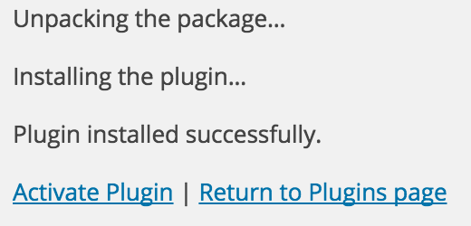

DiamanteDesk plugin allows adding support help desk to your blog or website. Any comments from the website may be converted into tickets and grouped into separate branches according to the topic or an account.

## Installing DiamanteDesk Plugin for WordPress

1. Log in the WordPress Admin Panel.
2. On the navigation panel head over to _Plugins > Add New_.

###### Automatic installation

1. Go to [WordPress Plugin Directory](https://wordpress.org/plugins/).
1. Enter **DiamanteDesk** in the **Search Plugins** field and press Enter.
1. Click **Install Now** and activate the plugin.

###### Manual installation

**Option 1 - Installation via FTP:**

1. Upload the addthis folder to the `/wp-content/plugins/` directory.
1. Activate the plugin through the **Plugins** screen in your WordPress admin area.

**Option 2 - Installation via archive:**

1. Download DiamanteDesk plugin for WordPress from Github.
2.  On the **Add Plugin** screen click **Upload Plugin**.
2. Select the downloaded zip file from your computer.
3. Click **Install Now**.
4. To install the plugin, WordPress needs to access your web server. Enter your FTP credentials to proceed. 
_**Note:** If you do not remember your credentials, contact your web host._

5. Click **Proceed**. If the plugin has been successfully installed, you shall see the following message:

6. Click **Activate Plugin**.

## Connecting DiamanteDesk to WordPress

After the plugin has been successfully installed, the DiamanteDesk menu item shall appear in the **Wordpress** admin menu. It shall be configured for the proper work of a help desk.

In order to do that, complete the following steps:

1. Acquire [API credentials](api-credentials.md) from your CRM.
5. Get back to **WordPress** Admin Panel.
6. Select **DiamanteDesk** menu item from the **WordPress** admin menu. DiamanteDesk plugin settings screen opens.

7. Provide the link to the server in the **Server Address** field.
8. Enter the **Username** and **Api Key** from your CRM.
9. Select the number of tickets which is going to be displayed in the admin widget.
10. Click **Test Connection** to make sure that the connection with a server has been successfully made. 
11. If the credentials are correct and the connection between WordPress and DiamanteDesk has been successfully made, a new **Default Branch** field will be added to the DiamanteDesk configuration. 

12. Select a default branch from the drop-down list.
13. Click **Save Changes**.