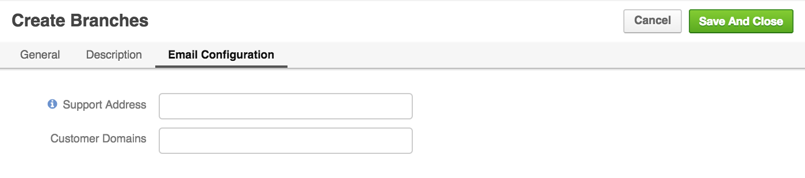
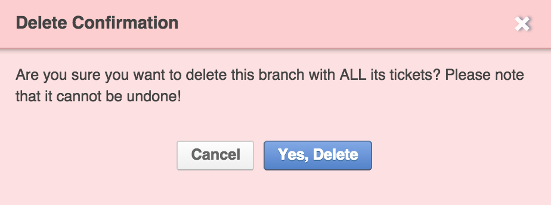

When a customer of any web service supported by the DiamanteDesk needs to report an issue or submit a request to the help desk team, a _ticket_ is created. Each ticket in DiamanteDesk application has a unique identificator and is sorted according to the _branch_ where it is created or is added to a default branch.

Creating separate branches in DiamanteDesk enables our Clients to group tickets according to the requests of specific users, locations, issues or according to the [Channel](channels/index.md) the ticket came from. Branch logic helps to organize tickets in a way to keep track of the tickets according to a certain category and quickly find them in a system. We remember that good customer service implies quick reaction and problem solving, so we do our best to provide our Clients with a user-friendly tool to make it work.

_**Note:** When the ticket is automatically created from the email received at the the support email address, this ticket is created at the branch which is configured as a default one. To learn more about it, please see the [Email Processing](channels/email-processing.md) section._

To see the list of all available branches, select the **Branches** tab at the navigation panel at the top of the home screen. 

## Branch Filters

All branches can be filtered according to the **Branch Name** or **Branch Key**. 

Branch key is automatically generated from the branch name when a new branch is created and it should be unique across the system. Branch key must contain only letters. Minimum length is 2 letters. If Branch name consists of more than one word, the system takes the first character of every word and converts them to upper case (for example, Green Daisy - GD, Diamante Desk - DD, etc.). If branch name consists of a single word, branch key is generated from the first 2-4 characters in the upper case (for example, Eltrino - ELTR, bbq - BBQ, etc.).

**Branch name** and **Branch Key** filters are set to **All** values by default. To filter the branches according to a certain branch name or key, click the down arrow in the corresponding filed and enter the required name or key. To refresh the results, click **Refresh**. To clear all filters, click **Reset**.

## Create a New Branch

Click **Create** at the right top corner of the **Branches** screen. **Create Branches** screen opens.

Provide the required information into each field. Not all the fields are required, but the more data you provide, the easier it is to distribute the tickets into the corresponding fields and finding them when they are needed:

Field  | Description
:------------- | -------------
Name  | _Required._ Provide the name of a new branch in this field.
Key | Leave a **Key** field empty as it is automatically filled by the system. Branch Key is generated from the branch name and it should be unique across the system.
Default Assignee | To select the **Assignee**, click **Unassigned**. A Search Panel opens. Next, the following two options are available: you can either start entering the name of the person to be assigned and the system will provide hints with matching results or you can click a list image to open a list of all available assignees. _**Note:** If you have selected a wrong assignee, click the X button next to the name of an assignee._
Image |Add an image that will serve as a branch logo to the **Image** field. To do that, click **Choose file** and select a required image from your local machine.
Tags | You can also tag your branch. Follow the link to learn more about [branch tagging](tagging.html).

Provide the description of the branch in the **Description** filed.

Provide the support email address relevant to this branch in the **Support Address** field (for example, it is a good idea to add all the tickets sent to sales@companyname.com to the "Sales" branch) and the customer domain name (for example, eltrino.com) to add all the emails sent from the email address with such customer domain to a specific branch.

Click [here](channels/email-processing.html) if you want to learn more about email processing in DiamanteDesk.

Click **Save And Close** at the right top corner of the screen.

## Edit / Delete a Branch

1. Navigate to the **Branches** screen.
2. Select the branch that shall be edited/deleted from the list of available branches. _**Note:** You can also filter the available branches according to the **Branch Name** and **Branch Key** to find a required branch quicker._
3. Click the branch that shall be edited / deleted. The **Branch** screen opens.
4. Select the corresponding action at the right top of the screen:

* If you click **Edit**, perform the necessary changes and click **Save** or **Save and Close**.
* If you click **Delete**, the following confirmation message is displayed:

_**Note:** If a branch is configured as the default for [Email Processing](channels/email-processing.md), the following message is displayed at the top of the **Branch** screen. In this case it cannot be deleted._

