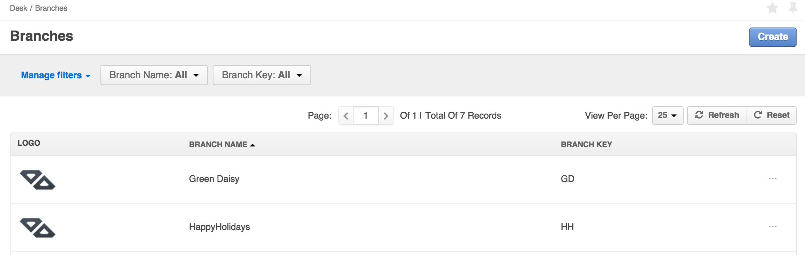
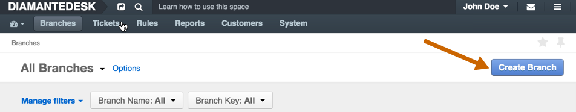
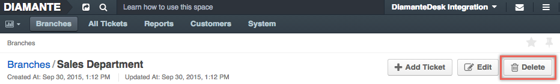
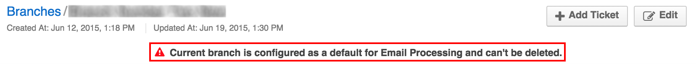
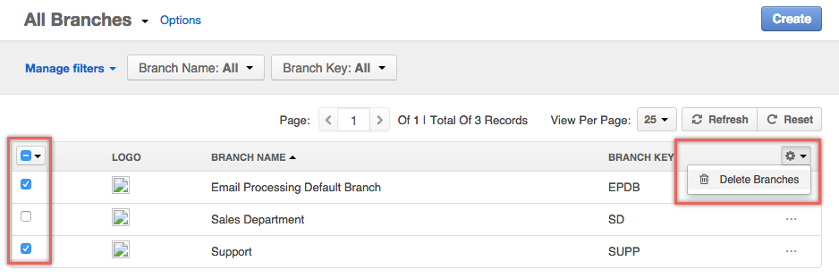
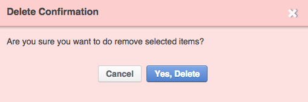

When a customer of any web service supported by DiamanteDesk needs to report an issue or submit a request to the help desk team, a _ticket_ is created. Each ticket is assigned with a unique ID and is sorted according to the _branch_ where it is created or is added to.

Creating separate branches in DiamanteDesk allows grouping tickets according to the requests of specific users, locations, issues or according to the [Channel](channels/index.html) of the ticket. Branch logic helps organizing tickets according to a certain category and helps finding them quickly. Reliable customer service implies quick problem solving, so we provide our Clients with a user-friendly tool making it run like clockwork.

This article answers the following questions:

* [How to create a Branch](#create-branch)
* [How to edit a Branch](#edit-branch)
* [How to delete a Branch](#delete-branch)

_**Note:** When the ticket is automatically created from the email received at the the support email address, it is created at the branch which is configured as a default one. To learn more about it, please see the [Email Processing](channels/email-processing.html) section._

To see the list of all available branches, select the **Branches** tab at the navigation panel. 

## Branch Filters

All branches can be filtered according to the **Branch Name** or **Branch Key**. 

**Branch name** and **Branch Key** filters are set to **All** values by default. To filter the branches according to a certain branch name or key, click the down arrow in the corresponding field and enter the required name or key. To refresh the results, click **Refresh**. To clear all filters, click **Reset**.

To learn more about filtering in DiamanteDesk, [follow this link](filters.html).

##  Create a New Branch

Click **Create Branch** at the right top corner of the **Branches** screen. 

The **Create Branches** screen opens.

Provide the necessary information in each field. Not all fields are required, but the more data you provide, the easier it is to distribute tickets into the corresponding branches and find them when they are needed:

Field  | Description
:------------- | -------------
Name  | _Required._ Provide a descriptive name of a new branch.
Key | Leave a **Key** field empty as it is automatically filled by the system. Branch key is generated from the branch name and it should be unique across the system. Branch key must contain only letters. Minimum length is 2 letters. If Branch name consists of more than one word, the system takes the first character of every word and converts them to upper case (for example, Green Daisy - GD, Diamante Desk - DD, etc.). If branch name consists of a single word, branch key is generated from the first 2-4 characters in the upper case (for example, Eltrino - ELTR, bbq - BBQ, etc.).
Default Assignee | To select the **Assignee**, click **Unassigned**. A Search Panel opens. Next, the following two options are available: you can either start entering the name of the person to be assigned and the system will provide hints with matching results or you can click a list image to open a list of all available assignees. _**Note:** If you have selected a wrong assignee, click the X button next to the name of the selected assignee._
Image |Add an image that will serve as a branch logo. Click **Choose file** and select a required image from your local machine.
Tags | You can tag your branch. Follow this link to learn more about [branch tagging](tagging.html).

Provide the description of the branch in the **Description** field.

##  Edit a Branch

1. Navigate to the **Branches** screen.
2. Select the branch that shall be edited from the list of available branches. The selected **Branch** screen opens.
3. Click **Edit** at the right top corner of the screen:

4. Perform the necassary changes/updates.
5. Click **Save** or **Save and Close** for the corresponding action.

##  Delete a Branch

Three options of branch deleting are available in DiamanteDesk:

* [deleting a single branch](#single-delete)
* [mass deleting](#mass-delete)
* [deleting branches via API](#API-delete)

###  Deleting a Single Branch

When attempting to delete a single branch in DiamanteDesk, keep in mind that ALL its tickets are going to be deleted as well.

1. Navigate to the **Branches** screen.
2. Select the branch that shall be deleted from the list. The selected **Branch** screen opens.
3. Click **Delete** at the right top corner of the screen:

_**Note:** When attempting to delete a single branch in DiamanteDesk, keep in mind that ALL its tickets are going to be deleted as well._
4. The following confirmation message appears:
SCREEN
5. To delete a branch but keep all the tickets in the system, select a corresponding checkbox in the warning message and choose a new branch where all the tickets shall be moved.

_**Note:** If a branch is configured as default for [Email Processing](channels/email-processing.html), it cannot be deleted and the following message is displayed at the top of the **Branch** screen:_

###  Branch Deleting Mass Action 

Multiple branches can be deleted via mass action functionality in DiamanteDesk. Perform the folllowing steps in order to delete several branches at once:

1. Navigate to the **Branches** screen.
2. Select several branches that shall be deleted from the list of available branches. 
3. Click the **Mass Actions** button and select the **Delete Branches** option as shown on the picture below.

4. The **Delete Confirmation** message opens.

5. Click **Delete** to proceed or **Cancel** to return to the **Branches** screen. _Branch cannot be deleted via mass action if it has any tickets. Only the branches without any tickets can be deleted during branch deleting mass action._

###  Deleting Branches through API

Branches can also be deleted via the API call. The DiamanteDesk [RESTful API guide is available here](../developer-guide/restful-api-guide.html).

_Please note that a branch cannot be deleted via API request if it has any tickets. Only the branches without any tickets can be deleted via API request._