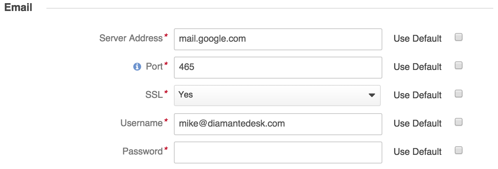

DiamanteDesk supports 4 possible options of contacting a service Help Desk team in order to create a new ticket and make a request or report an issue. Any user can do it through a [Portal](portal.html) or [Embedded Form](embedded-form.html), over the phone call or by sending an email to the support address.

All the emails that get to the support email address (or support email alias) are retrieved by the DiamanteDesk system in order to create a separate ticket out of each received letter. Tickets are created either at a single default branch or in different branches depending on the specific support address from the email alias. 

## Configuration

Most of the medium and large size companies use support email alias addresses (such as support@companyname.com, info@companyname.com, hq@companyname.com, sales@companyname.com) but in fact, all the emails that are sent to these addresses are stored at a single support email box. DiamanteDesk allows converting all these emails into the support tickets automatically and these tickets can be distributed to different branches depending on the support email they were sent to. Alternatively, all the created tickets are stored at a single branch, defined as a default one at _System > Configuration_.

To make sure that all customer requests sent to the service support email are converted into tickets by the system, the email processing feature shall be configured properly.

###### How to set up a support email

Go to _System > Configuration_. 

On the **System Configuaration** pane select the **DiamanteDesk** menu and **Channels** tab.

The **Channels** screen opens.

Configure the **Email** section to set up a support email. All the fields in the **Email** section are required fields and each of them has specific default settings. To use the default settings, select the **Use Default** check box in the corresponding field. To edit the configurations, clear the **Use Default** check box in the corresponding field and specify the necessary value.

Field  | Description
------------- | -------------
Server Address  | Specify the server address of the support email account (for example, imap.google.com)
Port | Provide the port number. _Hint:_ It is typically on port 143. But IMAP over SSL is usually on port 993.
SSL | Specify whether you want to use a secure connection (SSL) when retrieving your mail. Select **Yes** or **No** option.
Username | Provide the service support email (for example, support@diamantedesk.com).
Password | Provide the password for a support email account.

###### How to distribute tickets to different branches

Tickets created from emails can be distributed to different branches depending on the support email they were sent to. For example, tickets sent to info@companyname.com can be added to the "Info" branch, same as tickets sent to support@companyname.com can be added to the "Support" branch. Branch logic helps to organize tickets in a way to keep track of the tickets according to a certain category and quickly find them in a system. This option can be configured directly at the **Email Configuration** section of the **Branch** configuration screen when the branch is created or open the required branch and click **Edit**.

Provide the support email address relevant to this branch in the **Support Address** field (for example, it is a good idea to add all the tickets sent to sales@companyname.com to the "Sales" branch) and the customer domain name (for example, eltrino.com) to add all the emails sent from the email address with such customer domain to a specific branch.

###### How to add tickets to a single branch

To configure the email processing in a way when all the tickets created from emails are added to a single default branch, go to _System > Configuration_. On the **System Configuaration** pane select the **DiamanteDesk** menu and **Channels** tab. The **Channels** screen opens.

In the **General** section select a default branch for email processing. All the newly created tickets will automatically get to the specified branch.
To set one of the existing default branches as default one, make sure that the **Use Default** check box is clear, click the down arrow in the **Default Branch** field and select the required branch from the drop-down list. If the **Use Default** check box is selected, the branch that was created in the system first becomes a default one.

> _Note:_  A branch configured as a default one cannot be deleted.

After all the necessary information has been provided, click **Save Settings** at the right top part of the screen.

##Run Email Processing

You can also run and configure email processing from the console. Two commands are available:

* using IMAP protocol for email retrieval from a remote email server.


php app/console oro:cron:diamante:emailprocessing:general


This command may be configured through a crontab, allowing to send polls periodically on a given schedule it's perfect for retrieving emails from the remote server.

* or using the email piping method:


php app/console diamante:emailprocessing:pipe <  /path/to/emails/stream


This command is only applicable when DiamanteDesk and email server are installed on the same server machine. It includes piping method which has a remarkable advantage over a IMAP, as,  when using piping, all the emails get to the system and are converted into tickets or comments **immediately**, unlike when using IMAP which sends polls to the remote server within scheduled time (at least 1 minute). This advantage allows to quicky react on customer requests or solve any issues on a real-time basis.