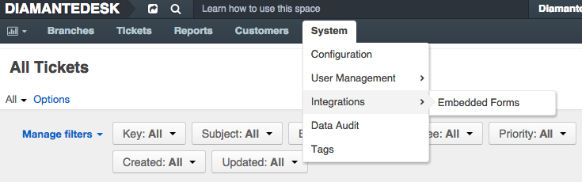
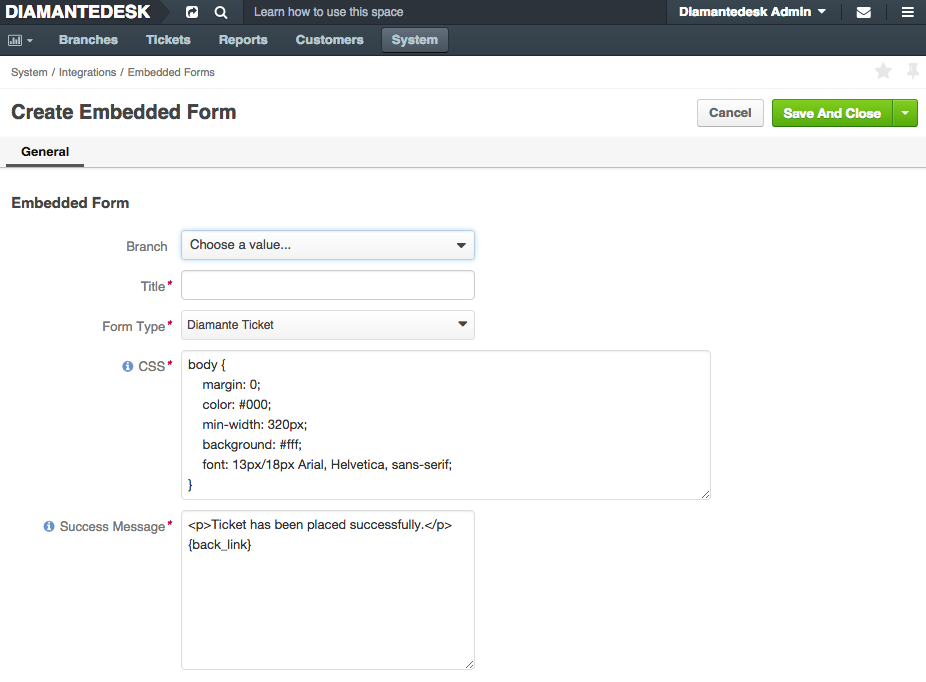
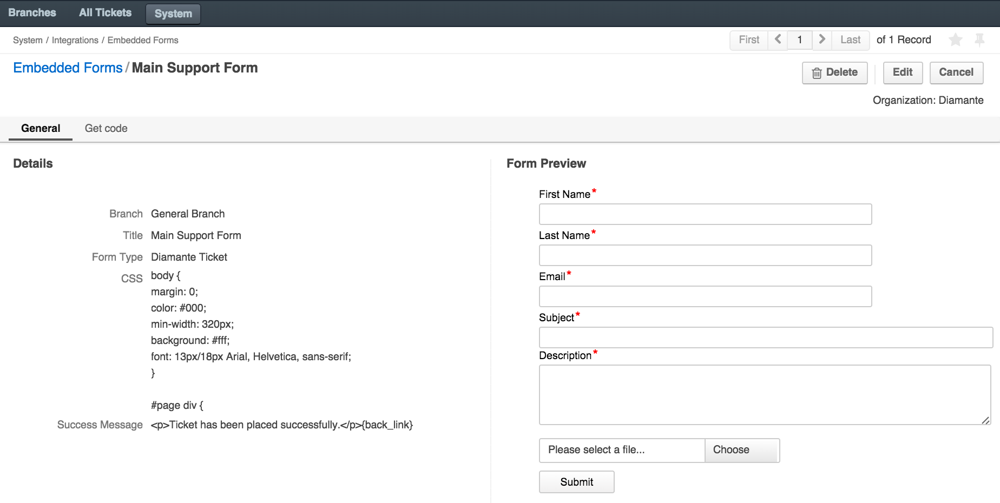
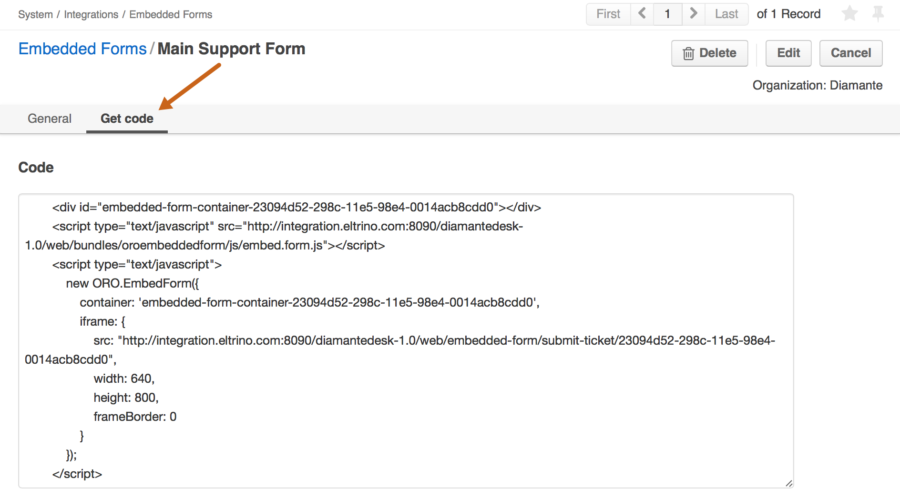

DiamanteDesk is designed to improve user experience for each of your present and future customer. 

In complex systems something may always go wrong and each user should always have a variety of options to contact your support team and let them know what should be fixed or changed. DiamanteDesk system offers several options to do that: 

* by sending an [email](email-processing.html)
* via a phone call, or
* through a [web portal](portal.html). Some of our Clients also prefer to embed a support form into their website.

DiamanteDesk provides an ability to easily creating embedded forms on the third-party websites. Take a look at the picture below to see the initial form. Bacground color and font color, size and style can be determined according to the design of your website.

This form includes fields for acquiring user name, **Email** used for informing a user on the status of a ticket creation and processing, the **Subject** field for a short precise description of a request or an issue, the **Description** field used for detailed specification of a reason to contact the support team and attachment field allowing users to add screenshots in case of UI issues.

After a user clicks the **Submit** button, the message from the embedded form is automatically converted into a ticket.

##Create Embedded Form

To create a new embedded form, head over to _System > Integrations > Embedded Forms_  and click **Create Embedded Form** at the right top corner of the screen.

**Create Embedded Form** screen opens. Fill out the fields to add a new embedded form to your website. 

>_Note:_ The required fields are marked with asterisk (*). 

Field  | Description
:------------- | :-------------
Branch  | Select the branch where all the tickets converted from the embedded form should be created. This may be a separate branch created specifically for such tickets or a certain website, etc. To learn more about **Branches**, take a look at the corresponding section in DiamanteDesk User Guide.
Title | Specify the title that is going to be used to refer to current embedded form on the Client system.
Form Type | Currently only one form type is available.
CSS | This field contains default CSS, which corresponds to the initial form design. It can be edited according to the design of your website by changing border width, color, fonts settings, etc.
Success Message | This message is to be displayed on the website after the successful form submission. It has the following default message: _Ticket has been placed successfully._

After all the required fields are filled out, click **Save and Close** or **Save** at the right top corner of the screen.

After the form is saved, it appears in the Embedded Forms grid.

##Edit / Delete Embedded Form

1. Go to  _System > Integrations > Embedded Forms_.
2. Select the form that shall be edited/deleted from the list of available embedded forms. 
3. Click the form that shall be edited / deleted. The **Embedded Form** screen opens.

##Adding Embedded Form to the Website

1. Go to  _System > Integrations > Embedded Forms_.
2. Open the form that should be added to the website.
3. Select the **Get Code** tab to view the source code.

4. Copy the code an add it to your website.
