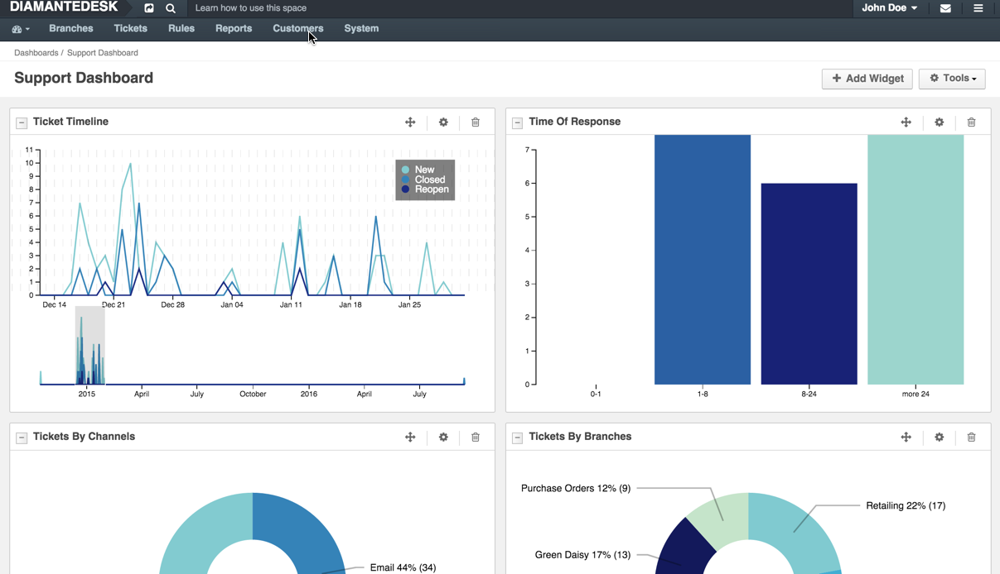
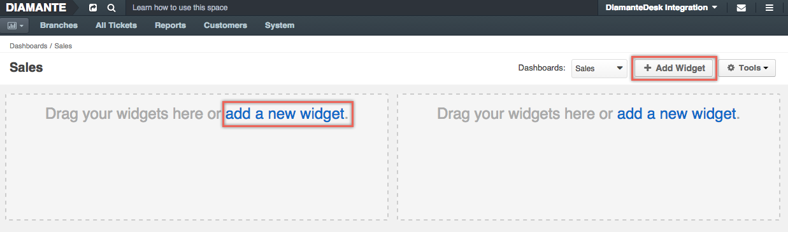
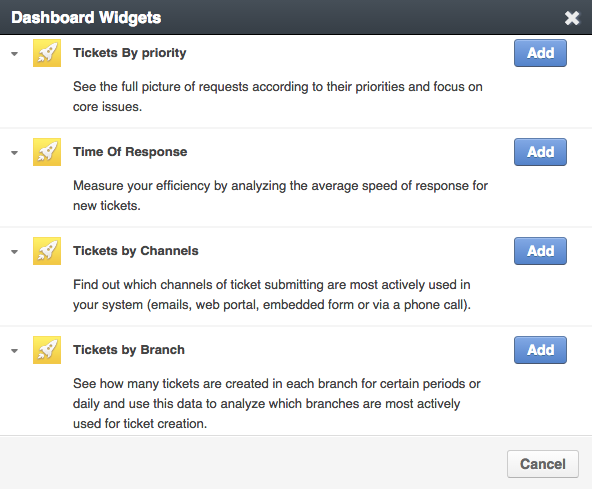
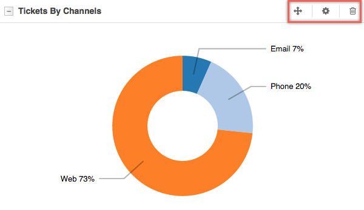

Dashboard is a progress control panel providing a quick access to the most valuable and constantly changing data of the system. Dashboard data is added to widgets. If needed, several dashboards may be created for different purposes to provide better organization and data clarity.

## Add new dashboard

To add a new dashboard:

1. Click the **Dashboard** icon at the left corner of the screen.

2. Select **Manage Dashboards** from the drop-down menu. 
_The **Manage Dashboards** screen opens_.
3. Click **Create Dashboard** at the top right corner of the screen.

At the opened screen, fill out the following fields:

Field | Description
------------- | -------------
Label  | Provide the name for this dashboard. If there are several dashboards in the system, make sure that dashboard name clearly describes its purpose.
Clone from  | This option allows copying one of the existing dashboards. For example, when several departments or administrators need separate dashboards where most widgets are similar but several other ones should be different, there is no need to create each widget from scratch. Click the down arrow and select the existing dashboard that shall be cloned. To create a new dashboard from scratch select **Blank Dashboard**. 
Owner | By default, this field is populated with the account of the administrator currently logged in the system. Click the **List** button to change a dashboard owner. An owner can manage the dashboard according to the needs of administrators. 

Click **Save** or **Save and Close** at the top right corner of the screen for the corresponding action. After the dashboard is saved, it becomes available by clicking the **Dashboards** icon at the top left corner of the screen. If it is cloned from another dashboard, it is going to contain the same widgets as the original one; if it is created from scratch, it is going to be empty (as shown in the example below).  

## Dashboard Widgets

Widgets in DiamanteDesk provide quick access to required information, often reflects Report data. 

To add a new widget:

1. Open the dashboard where a new widget shall be addded.
2. Click **[+ Add Widget]** at the top right corner of the screen or **add a new widget** at the corresponding widget placeholder. 

3. The **Dashboard Widgets** pop-up screen opens.

4. Select the required widget from the list and click **Add**. To add more widgets, repeat the procedure.

You can move, edit and delete each of the added widgets by using corresponding icons at the top of the widget section.

_**Note:** All the DiamanteDesk Reports can be added to the dashboard as widgets. To learn more about Reports, [follow this link] (reports.html)._