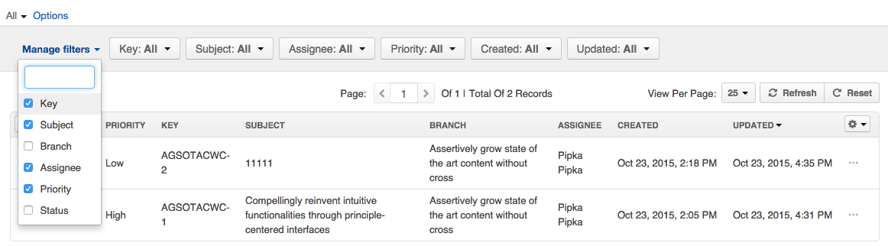

Filters in DiamanteDesk are a great tool helping you to quickly find any records, tickets and users you are searching for within the system. Every data grid can be filtered according to each grid parameter. You can learn more about filtering parameters of every data grid in the corresponding section of the user guide:

* [Branches](branches.html);
* [Tickets](tickets.html);
* [Customers](customers.html);
* [Users](users.html).

Generally, the filter bar is located above the grid as shown in the picture below:

##Manage Filters

By default, all the filter parameters are displayed at the filter bar as shown in the picture above, however, filter bar can also be configured according to your requirements. To hide / add filter parameters, click **Manage Filters** at the filter bar. A list of available filter parameters opens. Select / clear the required parameters to configure the filter bar according to your needs.

##Save Filter Query

If you  regularly use the same filter query, you can save it as a custom filtering option to pick out required records quickly and efficiently. In order to do that, once you applied all the filters and created a query that may be used later on, click **Options** > **Save As** above the filter bar.

Provide the name of a  new filter query and click **Save**, to quickly use it whenever needed.

Once saved, it is going to be available as a predefined custom query. Click **All** above the filter bar and select it from the drop-down list to quickly access it. Multiple custom filter queries may be added for to save your time when sorting out the required data from the grids.

##Predefined Filter Query

The **Tickets** grid contains several predefined filter queries to enable quick ticket search according to some of the highly required filtering options:

* **New tickets** picks out all the tickets with the **New** status value.
* **My Tickets** picks out all the tickets created by the account owner.
* **My New Tickets** picks out all the tickets created by the account owner with the **New** status value.
* **My Open Tickets** picks out all the tickets created by the account owner with the **Open** status value.

