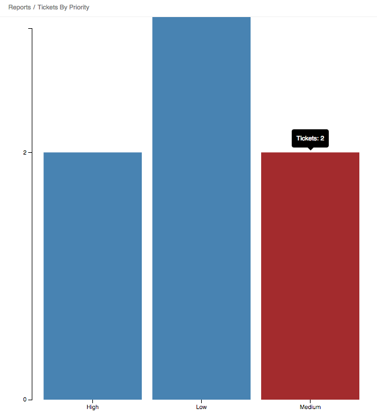
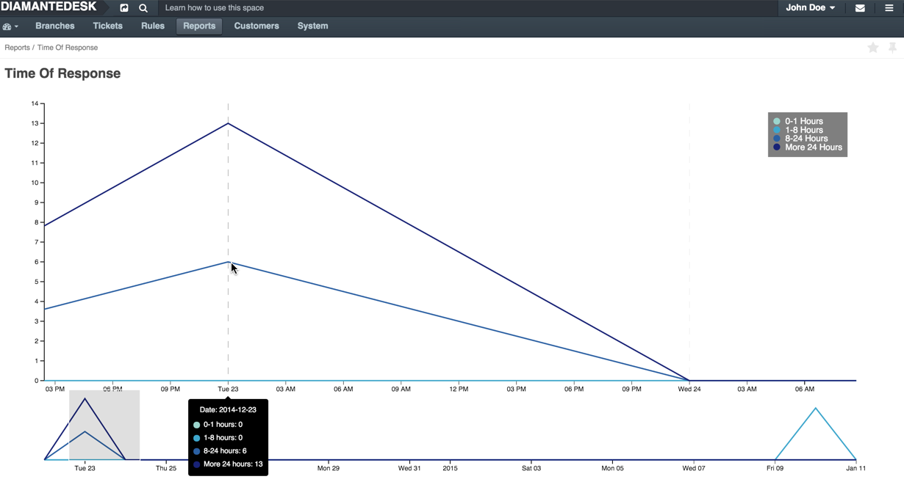
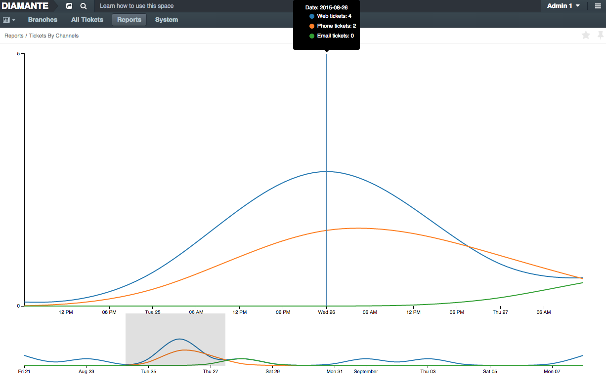
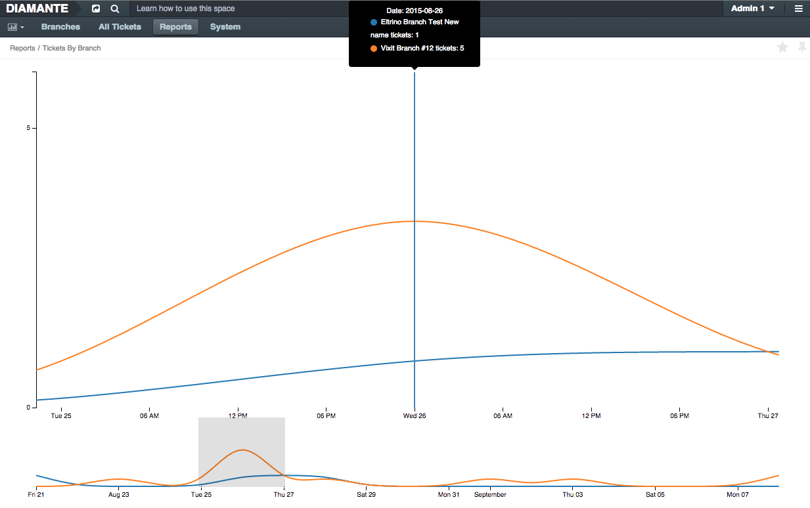
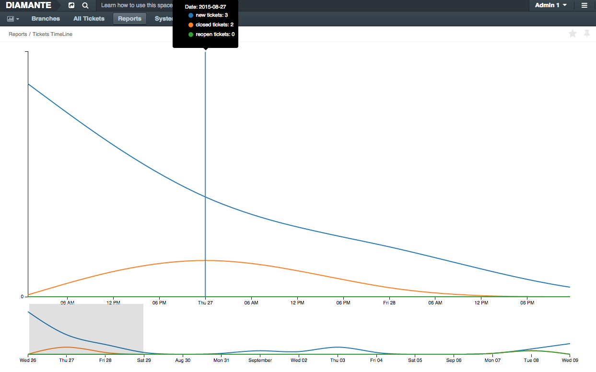

DiamanteDesk provides its customers with the extensive set of reports allowing managers to monitor daily ticket activity, measure performance of the support department according to the average resolution time and detect emerging or existing issues in the system. Successful leaders know that revealing emerging trends far on advance is beneficial for overall customer satisfaction. 

Each report serves a specific purpose and allows analyzing your support team efficiency according to different criteria and company goals. To see the list of reports available in DiamanteDesk, log into the system and select the **Reports** top menu. Currently, DiamanteDesk offers 5 reports providing the essential data necessary to analyze the performance of a support team:

* Tickets by Priority
* Time of Responce
* Tickets by Channels
* Tickets by Branches
* Tickets Timeline

##Types of Reports

**Tickets by Priority**                                                                                                                                                                                                    

This report provides the full picture of requests according to their priorities and allows focus on the critical ones. It also allows estimating the state of your system by analyzing the amount of urgent and high priority issues and focus on the general improvements, if necessary. 

This report also helps analyzing how customers estimate the issues they are dealing with while working with DiamanteDesk.

 ----CHANGE!!!

The report is presented as vertical bar graphs, each of them showing the amount of submitted tickets with **High**, **Low** and **Medium** priority. To know the exact number of tickets by of a certain priority, point to the required bar graph so that it changes its color to red and a tooltip with a number of tickets pops up.

**Time of Responce**

Measure your efficiency by analyzing the average speed of responce to the newly created tickets. We believe that quick reaction is a key factor to achieve high customer satisfaction. Whether the issue is complex and urgent or small and insignificant, your customers want to see that their request is taken care of.

 ----CHANGE!!!

The report is presented as vertical bar graphs, each of them showing the amount of tickets support agents responded to within one of the available time frames: 1-8 hours or more than 24 hours. To know the exact number of tickets with a public responce provided within the specific time frame, point to the required bar graph so that it changes its color to red and a tooltip with a number of tickets pops up.

**Tickets by Channels**

Find out which of the ticket submission methods are most actively used in your system (emails, web portal, embedded form or via a phone call) and use this report to figure out the support agents workload and make decisions on staff increase or reduction.

 ----CHANGE!!!

The report is presented as a line chart with each line displaying a set of data related to a certain channel of ticket submission. To see the exact number of tickets created at a certain day, point the line marker to a specific day on a chart. Look at the example above: 4 web tickets and 2 phone tickets were created on August, 26.

The second chart is aimed at scaling the area for the chart above. Highlight the area which shall be shown on the chart above to see a more detailed picture for a specific day or time period.

**Tickets by Branches**

See how many tickets are created in each of the branches for the certain period or daily and use this data to analyze which branches are most actively used for ticket creation.

 ----CHANGE!!!

The report is presented as a line chart with each line displaying a set of data related to a certain branch. To see the exact number of tickets created at a certain day, point the line marker to a specific day on a chart. Look at the example above: ___ August, 26.

The second chart is aimed at scaling the area for the chart above. Highlight the area which shall be shown on the chart above to see a more detailed picture for a specific day or time period.

**Tickets Timeline**

Check how many tickets were opened and closed per day for a given time period to measure the efficiency of the support team.

 ----CHANGE!!!

The report is presented as a line chart with each line displaying a set of data on the progress on **new tickets**, **closed tickets** and **reopen tickets**. To see the exact number of tickets created, closed or reopened at a certain day, point the line marker to a specific day on a chart. Look at the example above: 3 new tickets has been created and 2 tickets were closed on August, 27.

The second chart is aimed at scaling the area for the chart above. Highlight the area which shall be shown on the chart above to see a more detailed picture for a specific day or time period.

_Note: All the reports available in the DiamanteDesk can be added to the dashboard as widgets. To learn more about widgets in DiamanteDesk, refer to [this](dashboards.html) section._