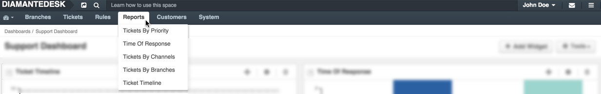

Tickets by Priority
See the full picture of requests according to their priorities and focus on core issues.

Time of Response
Measure your efficiency by analyzing the average speed of response for new tickets.

Tickets by Channels
Find out which channels of ticket submitting are most actively used in your system (emails, web portal, embedded form or via a phone call).

Tickets by Branches
See how many tickets are in each branch daily and use this data to analyze which branches are most actively used for ticket creation.

Tickets Timeline
Check how many tickets were opened and closed per day for a given time period.