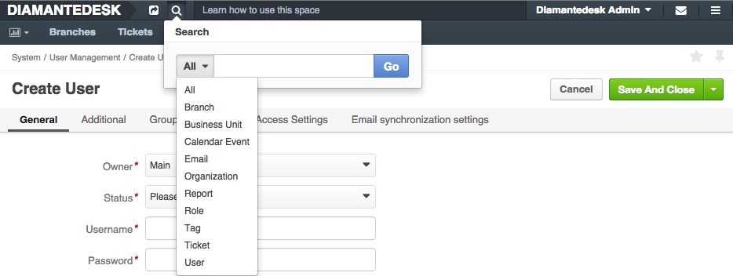

DiamanteDesk administrators can tag [Branches](branches.html) or [Tickets](tickets.html) in order to label them in a certain way. The process of ticket tagging is identical to branch tagging. The main purpose of tags in DiamanteDesk is to give administrators the ability to easily view similar branches.  When two or more branches are given the same tag, administrators can view all branches grouped together. When administrator clicks a certain tag, he can also view every single branch with the same tag.

>_Note:_ Tags are only visible for system administrators, regular users can not see them.

##Adding Tags

Tags can be added either when a new branch is created or whenever such need arises:

1. On the **Branch** screen move to **Tags** field. If no tags have been assigned to this branch, the field is marked as **Not tagged**.
3. Select an existing tag or create a new one. We add a **Business** tag as an example.

>_Note:_ Each branch can be labeled with the unlimited amount of tags.

## Search by Tags

To perform the search by tags, two options are available in the system:

* Click **Search** button on the top panel of the screen. A **Search** drop-box opens. Select the required category from the drop down list (in our case it is **Tag**). Enter the tag name and click **Go**.

* Click the tag label in on the **Branch** screen and the search will return all categories, such as branches, accounts and contacts tagged as **Business**.

Select the required category on the left side of the screen (in our case it is **Branches**).

Now the search displays all the branches tagged as **Business**.