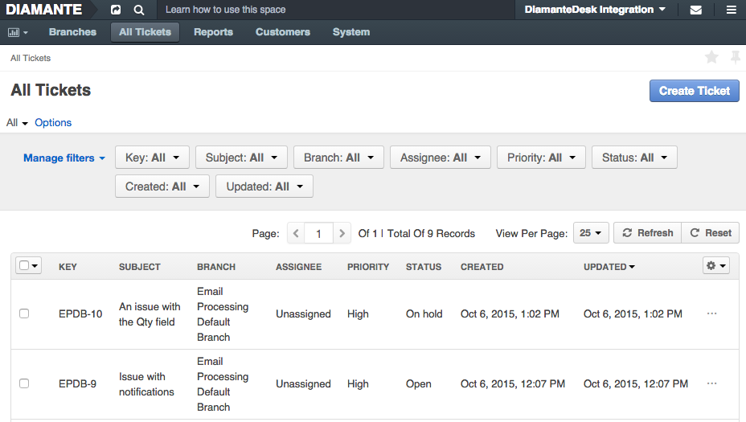
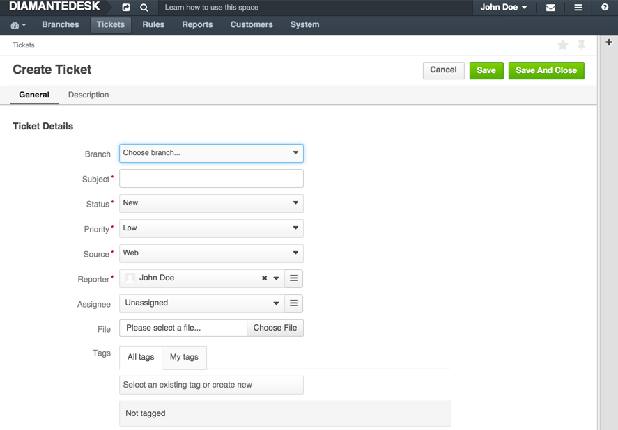
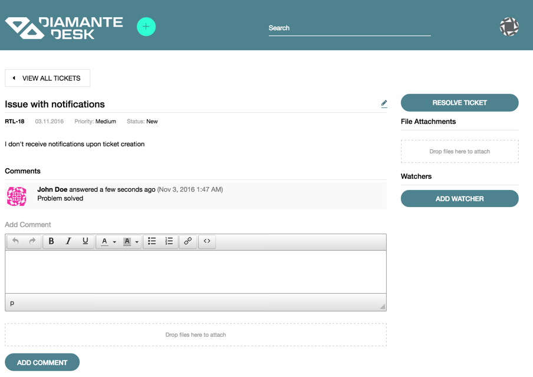
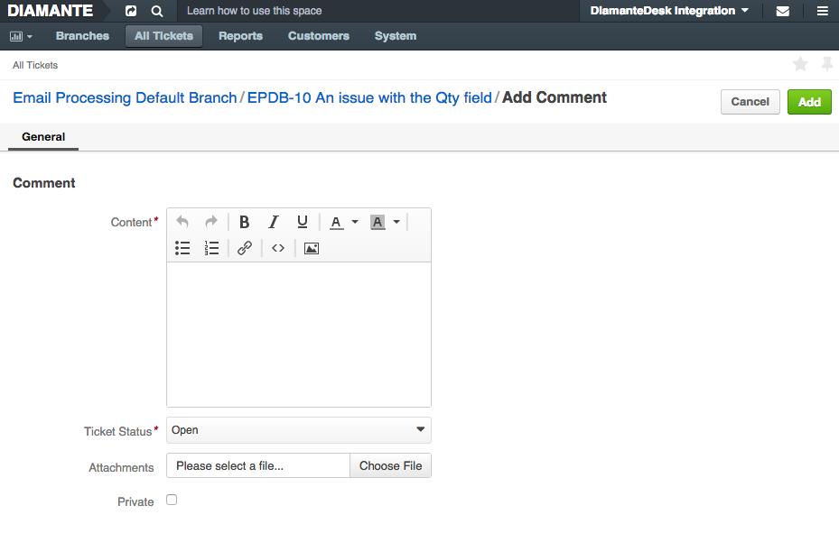
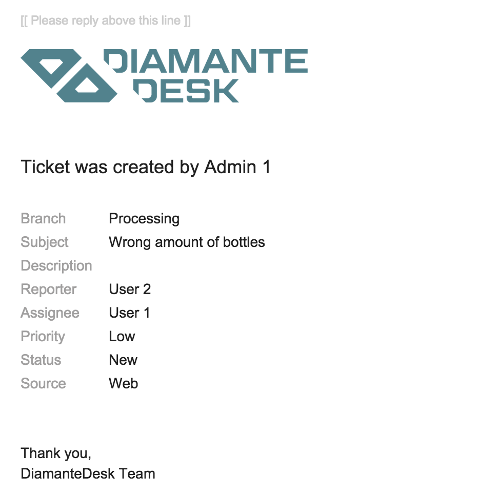
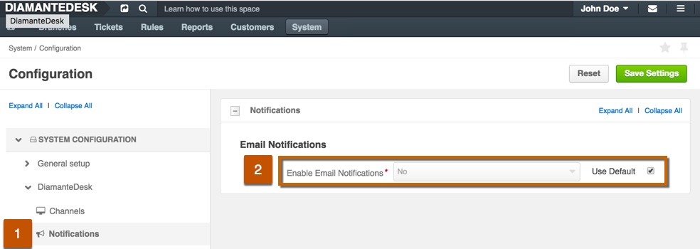
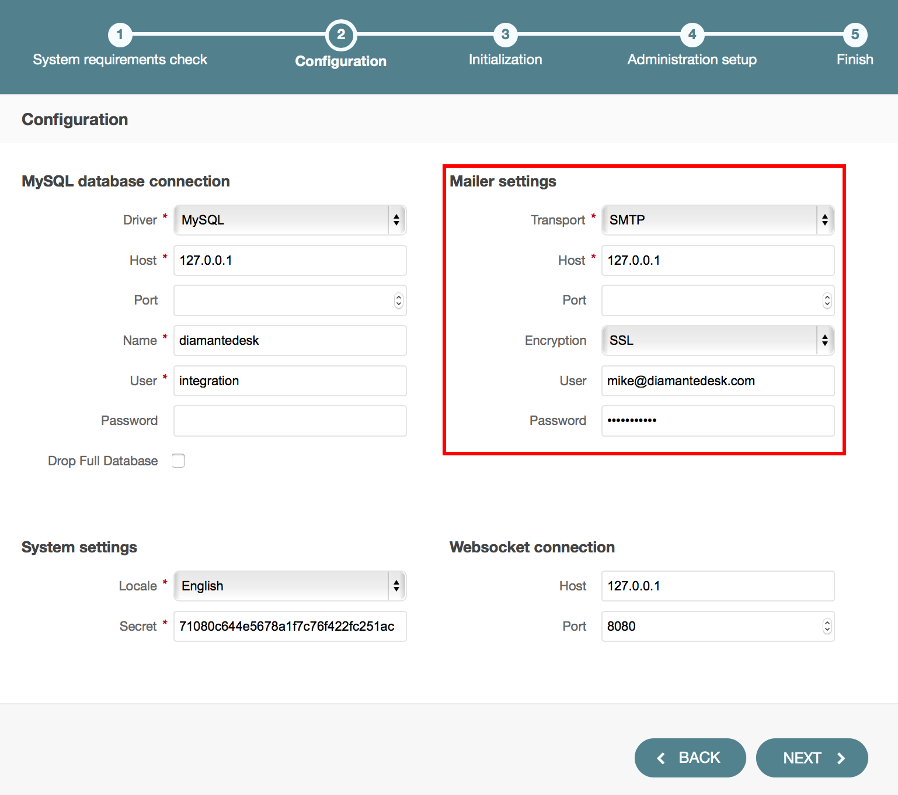
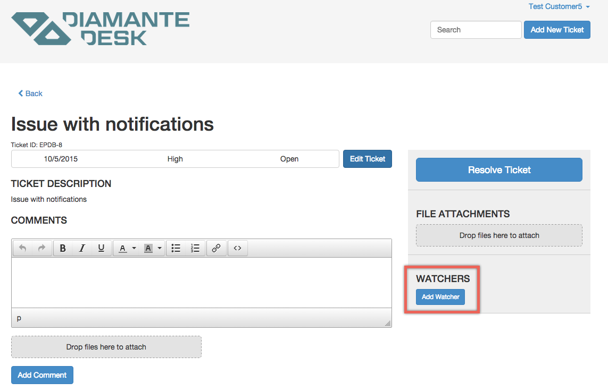
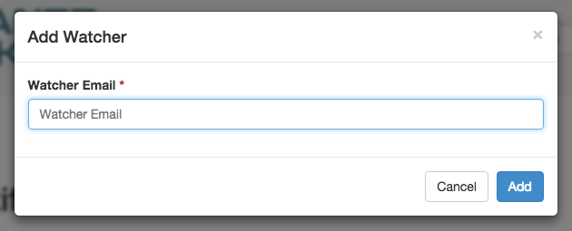
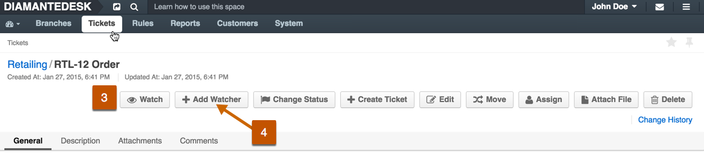

DiamanteDesk offers a great way to improve customer experience by easily receiving, reassigning and taking care of any Client requests presented as **tickets**.

Tickets in DiamanteDesk can be created through one of the following channels:

* through the [**web portal**](channels/portal.html);
* via [**embedded forms**](channels/embedded-form.html) on websites, online stores, blogs, etc.;
* via [**processing email requests**](channels/email-processing.html) sent to the support email address;
* by the admin users via the admin panel.

Tickets in the Admin panel can be viewed and created from:

* the **Branches** page (see [**Branches**](branches.html) section);
* the **Tickets** page.

## Ticket Filters

All tickets in the system can be filtered according to each of the parameters described in the table below. To learn more about filtering in DiamanteDesk, follow this [link](filters.html).

Filter   | Description
------------- | -------------
Key  | Enter the required branch key and click **Update**. Ticket Key consists of the branch key and ticket sequence number and has next format {_branchKey_}-{_ticketSequenceNumber_}. 
Subject | Provide the summary of a ticket in this field.
Branch | Select the required branch from the drop-down list and click **Update**.
Assignee | To filter the tickets assigned to a specific person, enter the name of that person into the **Assignee** field.
Priority | Set the filter to **Low**, **Medium** or **High** priority to seed out the tickets of the unnecessary priority.
Status | To filter the tickets according to their priorities, click the down arrow and select one or several statuses. The available statuses are: **New**, **Open**, **Pending**, **In progress**, **Closed** and **On Hold**.
Created | Select the date range when the tickets could be updated either from a drop-down calendar or by selecting one of the available variables (**Now, Today, Start of the week, Start of the month, Start of the quarter, Start of the year**).
Updated | Select the date range when the tickets could be updated either from a drop-down calendar or by selecting one of the available variables (**Now, Today, Start of the week, Start of the month, Start of the quarter, Start of the year**).

## Create a New Ticket

To create a new ticket, complete the following steps:

Click **Create Ticket** at the top right corner of the screen. The **Create Ticket** screen opens.

Provide all the relevant information necessary to create a new ticket:

Field  | Description
------------- | -------------
Branch  | Click the down arrow to choose a branch where this ticket should be created.
Subject | Provide the topic of an issue in this field.
Status | Select the status of a ticket. The available statuses are **New**, **Open**, **Pending**, **In Progress**, **Closed** and **On Hold**. When the ticket is just created, its status is normally set to **New** or **Open**.
Priority | Set the priority of the ticket according to the urgency of the issue occurred. The available priority options are **Low**, **Medium** or **High**.
Source | Specify the channel used to submit this ticket. The available options are: through **Web**, **Phone** or **Email**. To learn more about channels of ticket submitting, follow this [link](channels/index.html).
Reporter | Reporter is a user who created a ticket or who is in charge if it. This user receives notifications whenever the ticket status or priority changes. By default, the reporter is an owner of the account. To change the reporter, click the **List** button and select the corresponding user.
Assignee | Assignee is a person responsible for the ticket workflow. To change the assignee, click the **List** button and select the corresponding user.
File | In case there is a file that shall be attached to the ticket (screenshot or document), click **Choose file** and select the required file from your local machine.
Tags | Add tags for the further quick ticket search and classification. Follow the link to learn more about [tagging](tagging.html) in DiamanteDesk.

Provide the detailed description of a ticket in the **Description** field. If relevant, describe the steps to reproduce the bug/error.

Click **Save** or **Save and Close** at the right top corner of the screen for a corresponding action.

## Ticket Comments

Once the ticket is created and successfully saved in the system, customers can comment them from the portal and Admin users can reply from the Admin panel either publically or privately.

**Comments on the Portal**

Whenever DiamanteDesk customer needs to add more information about the issue or make a request about the previously created ticket, the comment to this ticket can be added on the portal. 

This comment automatically becomes available at the admin panel, updating admin users with new information/requests/issues occurred. Admins can comment tickets directly from the Portal as described below.

**Private Comments on the Admin Panel**

To add a comment to some ticket from the Admin panel, open the required ticked, scroll down to the very bottom of the page and click **Comment**. The **Add Comment** screen opens.

Field  | Description
------------- | -------------
Content  | This field contains the comment body.
Ticket Status  | Specify whether the ticket status should be changed. 
Attachments  | Attach screenshots clarifying or confirming information provided in the content field.
Private  | If this checkbox is selected, this comment is going to be available only on the Admin panel. If the checkbox is cleared, it is going to be available at the Admin panel as well as on the Portal.

## Notifications

**Email Notifications** is a DiamantDesk feature that sends automatic emails to the ticket creator and Assignee when the ticket is created or its [status](#status) changes. This way, a customer is notified whether his request is being processed.

When the ticket is created, a Reporter and Assignee get the following emails, informing them on ticket details (such as Branch, Subject, Priority, Status and Source):

When the status of a ticket changes, the reporter and assignee get the respective email as well.

### Configuring Notifications

This functionality can be configured according to the customer needs at _System > Configuration_:

1. On the **System Configuration** pane click **DiamanteDesk** to expose the available options and choose **Notifications**.

2. To use the default settings, select the **Use Default** check box in the **Email Notifications** field. 
To edit configurations, clear the the **Use Default** check box and set the **Enable Email Notifications** field to **Yes** or **No** option.

To save the changes made, click **Save Settings** at the top right corner of the screen.

### Server Setup

The mailer settings for emails and notifications are usually configured during DiamanteDesk installation. To learn more about the process of installation, navigate to the Installation Guide section of the documentation.

To make sure that server parameters are configured correctly or you need to change them, define required configuration details in the **app/config/parameters.yml** file. If you need more information on how to perform configurations in the **app/config/parameters.yml** file, follow this [link](https://symfony.com/doc/current/best_practices/configuration.html).

## Watchers

Each of the tickets can be assigned to a specific user to make sure that a given issue is solved quickly and efficiently. But in order to have more control over certain high priority issues, a new **Watchers** feature has been added.

A **Watcher** is a person who gets an email notification every time a status, priority or other ticket information changes. When the ticket is created, a **Reporter** (the person who created a ticket) and an **Assignee** (the person to whom the ticket is assigned) automatically become **Watchers**. If the ticket is created by the admin user, he automatically becomes a ticket watcher as well.

###Adding Watchers to the Ticket

Watchers can be added to the ticket in one of the following ways:

* **By Customers via Email**

In case the ticket is created from the email through [email processing](email-processing.html), the email sender and all the users from CC (if any) become watchers and receive email notifications each time the ticket content, status or priority is changed.

* **By Customers via Portal**

To add watchers to the ticket via the portal, complete the following steps:

1. Log into the Portal.
2. Create a new ticket. To get the detailed instructions on how to create ticket via the portal, please refer to [this section](#create-a-new-ticket).
3. Once the ticket is submitted, the screen with ticket description and editing options is opened. At the right side of this screen in the **Watchers** section click **Add Watcher** to add a person or several people who will be able to control the ticket workflow.

4. The **Add Watcher** pop-up opens. Specify the email of a person you would like to make a watcher for this ticket and click **Add**. If this email has been previously registered in DiamanteDesk, the system will recognize this user and add person's first an last name to the list of watchers. If no matching account has been found, a new [customer](customers.html) is created.

5. An email confirmation is sent to a person whose email was provided at the **Add Watcher** screen, notifying him on the new role granted.

* **By Admins via Admin Panel**

Admin user can add or remove certain users from the list of ticket watchers if he has respective edit permissions. To follow the changes made in a certain ticket or add other customers/administrators to the list of Watchers, Admin should perform the following steps:

1. Log into the DiamanteDesk Admin panel.
2. Open the required ticket.
3. To to be aware of the changes made to the ticket, click **Watch** on the option panel at the top of the screen. 

4. To add another person to the **Watchers** list, click **Add Watcher** on the option panel. The **Add Watcher** screen opens. Enter the name of a required user or click a list button and select a user from the list of available users.
